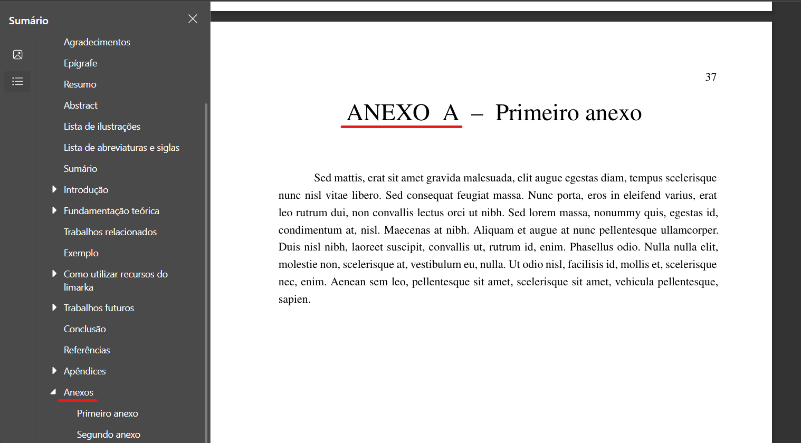

# Anexos

Os anexos são elementos pós-textuais utilizados para complementar o conteúdo do TCC, apresentando materiais que não foram produzidos pelo autor, mas que são relevantes para a compreensão ou enriquecimento do trabalho apresentado.

## O que são anexos no TCC?

Anexos são documentos, arquivos ou conteúdos externos ao autor do TCC, inseridos com a finalidade de ilustrar, embasar ou expandir a compreensão sobre algum ponto do estudo. Eles são identificados por letras (Anexo A, Anexo B, etc.) e colocados ao final do trabalho, após os apêndices, caso existam.

## Quando os anexos no TCC devem ser usados?

Você deve utilizar anexos quando quiser incluir:

- Leis, decretos, normas técnicas;
- Artigos de terceiros;
- Manuais ou guias de uso de ferramentas;
- Prints de sistemas, capturas de telas e materiais auxiliares;
- Documentos oficiais que você não escreveu, mas que são relevantes para seu TCC.

Esses documentos devem ser mencionados no corpo do texto principal e apresentados na íntegra nos anexos.

## Apêndice e anexo no TCC são iguais?

Embora ambos sejam elementos pós-textuais, existe uma diferença fundamental entre eles:

- **Apêndice**: Material produzido pelo autor do TCC.
- **Anexo**: Material de terceiros, que não foi elaborado pelo autor, mas que serve de apoio ao trabalho.

## Como adicionar anexos com VixeText

Para adicionar anexos no seu projeto com VixeText, siga os passos abaixo:

### 1. Ative a opção no arquivo de configuração

Edite o arquivo `configuracao.yaml` e adicione ou altere a seguinte linha:

```yaml
anexos: true
```

### 2. Crie o arquivo `anexos.md`

Na raiz do seu projeto, crie um arquivo chamado `anexos.md`. É nele que você irá incluir os materiais anexados.

### Exemplo de estrutura do arquivo `anexos.md`

```md
# Primeiro anexo

\lipsum[30]

# Segundo anexo

\lipsum[31]
```

Substitua os comandos `\lipsum` pelo conteúdo real que deseja anexar, como trechos de documentos, prints, textos de leis, etc.

### Resultado no PDF

Veja abaixo um exemplo de como os anexos são exibidos após a compilação:



Com essa estrutura, o VixeText gera automaticamente a seção de anexos no seu TCC, organizando os conteúdos de forma profissional, conforme as normas acadêmicas.
