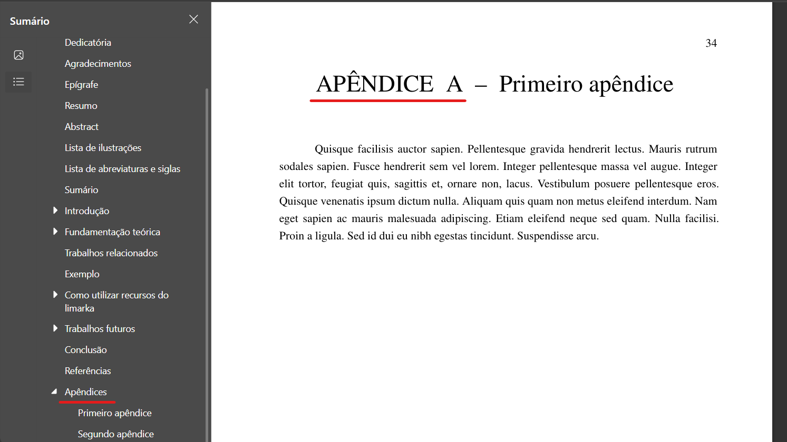

# Apêndices

Os apêndices são elementos pós-textuais utilizados para complementar o conteúdo do TCC, apresentando materiais produzidos pelo próprio autor que não foram incluídos diretamente no corpo principal do texto para não interromper o fluxo da leitura.

## O que são apêndices no TCC?

Apêndices são documentos, informações ou conteúdos elaborados pelo autor do trabalho, que servem como material de apoio ou ilustração, ampliando o entendimento do leitor sobre pontos específicos do estudo. Eles são identificados por letras (Apêndice A, Apêndice B, etc.) e são apresentados após as referências e, se houver, antes dos anexos.

## Quando o apêndice no TCC deve ser usado?

Você deve utilizar apêndices quando precisar incluir no seu trabalho:

- Códigos-fonte desenvolvidos por você;
- Questionários e formulários aplicados na pesquisa;
- Resultados extensos de experimentos ou análises;
- Tabelas ou gráficos detalhados demais para o corpo principal do texto;
- Exemplos de documentos produzidos como parte do projeto.

Esses materiais não devem ser essenciais para a leitura do texto, mas devem funcionar como aprofundamento opcional para quem quiser consultar.

## Apêndice e anexo no TCC são iguais?

Não. Apesar de estarem ambos nos elementos pós-textuais e servirem como material complementar, existe uma diferença fundamental:

- **Apêndice**: Material criado pelo próprio autor do trabalho.
- **Anexo**: Material de terceiros, que o autor apenas reproduz ou transcreve (como leis, artigos, manuais, etc.).

## Como adicionar apêndices com VixeText

Para adicionar apêndices no seu projeto VixeText, siga os passos abaixo:

### 1. Habilite a opção no arquivo de configuração

No arquivo `configuracao.yaml`, ative os apêndices com a seguinte configuração:

```yaml
apendices: true
```

### 2. Crie o arquivo `apendices.md`

Crie um arquivo chamado `apendices.md` na raiz do projeto. Neste arquivo você poderá inserir seus conteúdos complementares.

### Exemplo de estrutura do arquivo `apendices.md`

```md
# Primeiro apêndice

\lipsum[50]

# Segundo apêndice

\lipsum[55-57]
```

> Você pode substituir os comandos `\lipsum` por seu conteúdo real, como códigos, formulários, tabelas, imagens ou descrições.

### Resultado no PDF

Veja abaixo um exemplo visual de como os apêndices são exibidos no documento final:



Com essa estrutura, o VixeText garante que seus apêndices sejam exibidos corretamente e organizados de forma profissional, conforme as normas acadêmicas.
