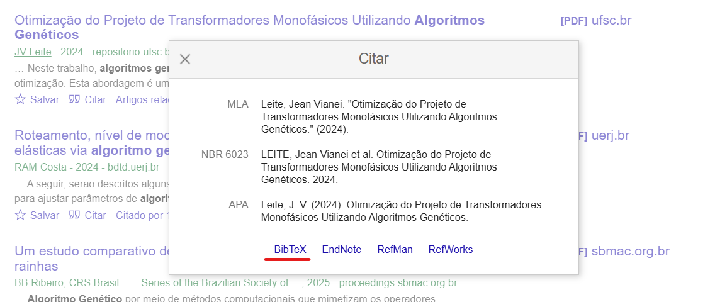

# Referências

As referências são elementos essenciais em qualquer TCC, garantindo o crédito adequado às fontes utilizadas ao longo do estudo, sejam livros, artigos científicos, páginas web, entre outros. A correta elaboração das referências contribui para a credibilidade acadêmica do trabalho e facilita que leitores possam acessar as fontes originais citadas.

## O que são referências no TCC?

Referências são um conjunto organizado de informações que identificam claramente cada uma das fontes utilizadas ou mencionadas ao longo do texto acadêmico. Elas seguem padrões específicos, geralmente definidos por normas como as da ABNT, garantindo consistência e facilitando a consulta por parte dos leitores.

## O que é o BibTeX?

BibTeX é um sistema utilizado para a gestão automática de referências bibliográficas, amplamente utilizado em documentos científicos e acadêmicos elaborados em LaTeX ou Markdown. O BibTeX permite armazenar as informações das fontes de maneira organizada em um arquivo específico, facilitando a geração automática de listas de referências.

## Por que usar o BibTeX?

Utilizar BibTeX oferece diversas vantagens:

- **Automatização:** Referências são geradas automaticamente a partir das citações realizadas no texto.
- **Organização:** Todas as referências são armazenadas de forma estruturada e padronizada.
- **Consistência:** Mantém o padrão e coerência em todas as referências bibliográficas do trabalho.
- **Facilidade de gerenciamento:** Permite fácil atualização e inclusão de novas referências.

## Como utilizar referências com VixeText

No VixeText, a página de referências é criada automaticamente utilizando BibTeX, à medida que citações são realizadas no texto. As referências são armazenadas e gerenciadas no seguinte arquivo:

- **`config\referencias.bib`**: Arquivo BibTeX onde você deve salvar todas as referências utilizadas em seu trabalho.

Se precisar entender melhor como realizar citações no seu texto, consulte a documentação detalhada sobre tipos de citação:

- [Link para a documentação sobre citações](/category/referências-e-citações)

## Mini tutorial: Como adicionar referências usando o Google Scholar

Siga os passos abaixo para inserir referências BibTeX em seu arquivo:

1. **Acesse o Google Scholar**:
   - Entre em [Google Scholar](https://scholar.google.com/).
2. **Busque o artigo desejado**:
   - Digite na barra de pesquisa o título ou palavras-chave relacionadas ao artigo.
3. **Obtenha a referência BibTeX**:

   - Clique no ícone de aspas (**Cite**) abaixo do resultado escolhido.
   - Clique no link **BibTeX** para abrir uma nova página com a referência em formato BibTeX.



4. **Copie a referência**:
   - Copie o conteúdo exibido.
5. **Adicione a referência ao arquivo `referencias.bib`**:
   - Abra o arquivo `config\referencias.bib` no VixeText.
   - Cole a referência copiada ao final do arquivo.

Exemplo de referência em BibTeX:

```bibtex
@article{alves2023markdown,
  title={Uso de Markdown em documentos acadêmicos},
  author={Alves, João Silva},
  journal={Revista de Tecnologia Acadêmica},
  volume={10},
  number={2},
  pages={100-115},
  year={2023},
  publisher={Editora Acadêmica}
}
```

Após salvar a referência em seu arquivo `.bib`, você pode citá-la normalmente em seu texto. O VixeText cuidará automaticamente da geração e organização das referências em conformidade com as normas acadêmicas utilizadas no seu documento.

Dessa forma, o VixeText facilita significativamente o gerenciamento das referências em seu TCC, tornando o processo prático, consistente e organizado.
