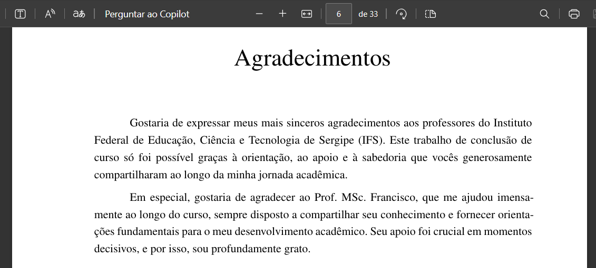

# Agradecimentos

Os agradecimentos são uma seção do TCC destinada a expressar gratidão a todas as pessoas, instituições e circunstâncias que contribuíram direta ou indiretamente para a realização do trabalho acadêmico.

## O que é um agradecimento no TCC?

Diferentemente da dedicatória, os agradecimentos apresentam um reconhecimento amplo e geral a várias pessoas, como familiares, orientadores, colegas, amigos, instituições acadêmicas e outras entidades que tiveram um papel relevante durante o desenvolvimento e a conclusão do trabalho.

Os agradecimentos geralmente possuem um tom formal, porém podem conter elementos pessoais que refletem a gratidão sincera do autor.

## Como fazer os agradecimentos?

Os agradecimentos devem ser claros, objetivos e geralmente apresentados em um texto curto ou médio, destacando as contribuições mais significativas. Recomenda-se que sejam organizados por relevância, começando pelas pessoas ou entidades mais importantes.

### Exemplos de agradecimentos

Seguem alguns exemplos prontos para uso ou inspiração:

- "Agradeço primeiramente a Deus pela sabedoria e força durante toda esta jornada acadêmica."
- "Expresso minha gratidão ao Prof. MSc. Francisco, meu orientador, pelo apoio constante e orientação valiosa em todas as etapas deste trabalho."
- "Meus agradecimentos à minha família, especialmente aos meus pais, pelo suporte emocional e financeiro imprescindível durante minha formação acadêmica."
- "Sou profundamente grato(a) aos meus colegas de curso, cujas discussões e troca de experiências enriqueceram este trabalho."

## Configuração dos agradecimentos

No projeto VixeText, os agradecimentos são configurados no arquivo `configuracao.yaml`, facilitando sua customização sem alterar diretamente o arquivo principal:

```yaml
agradecimentos: '@import(pages/agradecimentos.md)'
```

Essa configuração permite importar o conteúdo do arquivo Markdown externo, localizado em `pages/agradecimentos.md`.

### Exemplo de arquivo `agradecimentos.md`

Veja abaixo um exemplo de como estruturar o conteúdo do arquivo `pages/agradecimentos.md`:

```md
# Agradecimentos

Gostaria de expressar meus mais sinceros agradecimentos aos professores do Instituto Federal de Educação, Ciência e Tecnologia de Sergipe (IFS). Este trabalho de conclusão de curso só foi possível graças à orientação, ao apoio e à sabedoria que vocês generosamente compartilharam ao longo da minha jornada acadêmica.

Em especial, gostaria de agradecer ao Prof. MSc. Francisco, que me ajudou imensamente ao longo do curso, sempre disposto a compartilhar seu conhecimento e fornecer orientações fundamentais para o meu desenvolvimento acadêmico. Seu apoio foi crucial em momentos decisivos, e por isso, sou profundamente grato.
```

O autor pode editar livremente esse arquivo para refletir suas próprias palavras de gratidão, adaptando-o às necessidades específicas do trabalho. Veja o exemplo:



Com essas orientações, o VixeText torna a inclusão dos agradecimentos uma tarefa simples e eficiente, contribuindo para um documento acadêmico completo e bem estruturado.
