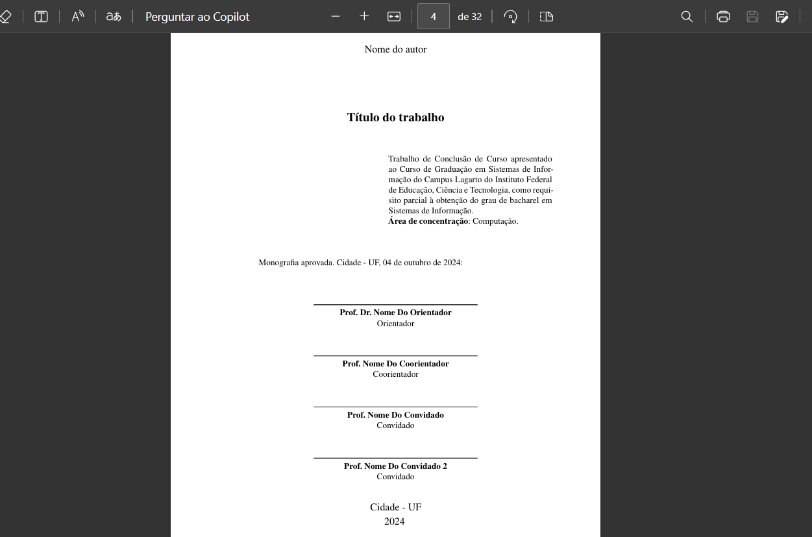

# Folha de aprovação

A folha de aprovação é um documento essencial em um TCC. Ela formaliza o aceite do trabalho acadêmico pelos membros da banca avaliadora, conferindo legitimidade e oficializando sua aprovação dentro dos padrões acadêmicos exigidos pela instituição de ensino.

## Importância da folha de aprovação

A folha de aprovação atesta oficialmente que o trabalho apresentado pelo estudante foi avaliado e aprovado por especialistas da área, refletindo qualidade, relevância acadêmica e rigor científico. Além disso, serve como registro institucional indispensável para processos administrativos posteriores, como a obtenção do diploma.

## Configuração da folha de aprovação

No projeto VixeText, as configurações da folha de aprovação são gerenciadas através do arquivo `configuracao.yaml`. Nele, você pode definir diversos parâmetros essenciais para adequar o documento às necessidades específicas do seu curso e instituição.

Os principais parâmetros de configuração incluem:

```yaml
author: Nome do autor
title: 'Título do trabalho'
area_de_concentracao: Computação
proposito: '@import(pages/proposito.md)'
tipo_do_trabalho: Monografia
local: Cidade - UF
aprovacao_dia: '04'
aprovacao_mes: 'outubro'
date: '2024'
coorientador: 'Prof. Nome Do Coorientador'
orientador: 'Prof. Dr. Nome Do Orientador'
avaliador1: 'Prof. Nome Do Convidado'
avaliador2: 'Prof. Nome Do Convidado 2'
```

Cada propriedade tem sua importância específica:

- **author:** Nome completo do autor principal.
- **title:** Título formal e completo do trabalho.
- **area_de_concentracao:** Campo acadêmico ou área de estudo relevante ao trabalho.
- **proposito:** Importação de um arquivo Markdown para descrição detalhada do propósito.
- **tipo_do_trabalho:** Tipo específico de trabalho acadêmico (Monografia, Dissertação, Tese, etc.).
- **local:** Local onde o trabalho foi apresentado e aprovado (Cidade - UF).
- **aprovacao_dia:** Dia da aprovação formal pela banca.
- **aprovacao_mes:** Mês da aprovação formal.
- **date:** Ano de aprovação do trabalho.
- **coorientador:** Nome e título acadêmico do coorientador, se houver.
- **orientador:** Nome e título acadêmico do orientador principal.
- **avaliador1 e avaliador2:** Nomes dos membros convidados para compor a banca avaliadora.

## Visualização

Após configurar adequadamente esses parâmetros, a folha de aprovação apresentará claramente todos os detalhes necessários para a formalização do trabalho, incluindo as assinaturas e informações da banca avaliadora, garantindo conformidade institucional e um aspecto profissional ao documento produzido pelo VixeText. Veja o exemplo:


