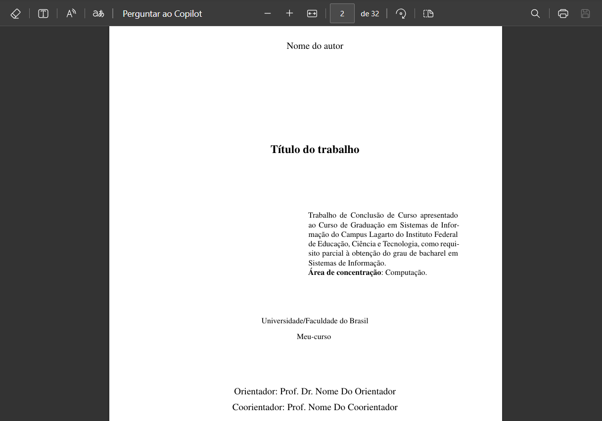

# Folha de rosto

A folha de rosto é uma das partes essenciais em trabalhos acadêmicos, especialmente em um TCC. Trata-se de uma página interna que apresenta informações fundamentais sobre o trabalho, incluindo o título, nome do autor, instituição de ensino, curso, orientadores e a finalidade do trabalho.

## Importância da folha de rosto

A folha de rosto desempenha um papel crucial, pois fornece aos leitores uma visão clara e imediata sobre a natureza e o contexto do trabalho, destacando as informações institucionais, acadêmicas e autorais essenciais. Além disso, ela contribui para uma apresentação formal e padronizada do documento, atendendo às normas acadêmicas exigidas pelas instituições.

## Configuração da folha de rosto

No projeto VixeText, a folha de rosto pode ser personalizada através do arquivo de configuração `configuracao.yaml`. Este arquivo contém parâmetros específicos que facilitam a adequação às necessidades do autor e da instituição acadêmica.

Os principais parâmetros de configuração são:

```yaml
author: Nome do autor
title: 'Título do trabalho'
instituicao: Universidade/Faculdade do Brasil
curso: Meu-curso
area_de_concentracao: Computação
coorientador: 'Prof. Nome Do Coorientador'
orientador: 'Prof. Dr. Nome Do Orientador'
proposito: '@import(pages/proposito.md)'
```

Cada propriedade possui uma função específica:

- **author:** Nome completo do estudante ou autor principal.
- **title:** Título completo e formal do trabalho acadêmico.
- **instituicao:** Nome completo da instituição acadêmica.
- **curso:** Nome do curso que o autor está cursando.
- **area_de_concentracao:** Área acadêmica ou campo de estudo relacionado ao trabalho.
- **coorientador:** Nome completo e título acadêmico do coorientador, se houver.
- **orientador:** Nome completo e título acadêmico do orientador principal.
- **proposito:** Define o propósito do trabalho através da importação de um arquivo Markdown.

### Arquivo de propósito

A propriedade `proposito` importa conteúdo de um arquivo Markdown externo, permitindo que o autor customize livremente o texto conforme suas necessidades acadêmicas e institucionais. Por exemplo, um arquivo padrão localizado em `pages/proposito.md` pode ter o seguinte conteúdo:

```md
# Propósito

Trabalho de Conclusão de Curso apresentado ao
Curso de Graduação em Sistemas de Informação
do Campus Lagarto do Instituto Federal de
Educação, Ciência e Tecnologia, como requisito
parcial à obtenção do grau de bacharel em
Sistemas de Informação.
```

O usuário pode editar diretamente este arquivo para personalizar o propósito conforme as exigências específicas de sua instituição ou curso.

## Visualização

Após configurada corretamente, a folha de rosto exibirá claramente todas as informações mencionadas acima, proporcionando uma apresentação organizada, padronizada e profissional ao documento acadêmico. Veja o exemplo:



A correta configuração destas propriedades garantirá que a folha de rosto do trabalho acadêmico esteja em total conformidade com as normas institucionais, oferecendo clareza e formalidade ao documento produzido no VixeText.