# Listas

Listas ajudam a organizar informações em documentos científicos e técnicos. Use listas para apresentar etapas, critérios, categorias, objetivos, resultados ou qualquer conjunto de itens relacionados.

No VixeText, você pode criar a maior parte das listas usando apenas Markdown. Essa é a forma recomendada, principalmente para quem não deseja escrever código LaTeX.

## Listas não ordenadas

Use listas não ordenadas quando os itens não precisam seguir uma ordem específica.

Para criar esse tipo de lista, use um hífen (`-`) seguido de um espaço.

**Exemplo:**

```md
- Objetivo geral da pesquisa
- Objetivos específicos
- Questões de pesquisa
- Procedimentos metodológicos
```

Você também pode usar asterisco (`*`) ou sinal de adição (`+`). Na saída em PDF, esses marcadores normalmente aparecem com o mesmo estilo visual.

Veja, na imagem abaixo, como essa lista é renderizada no PDF:

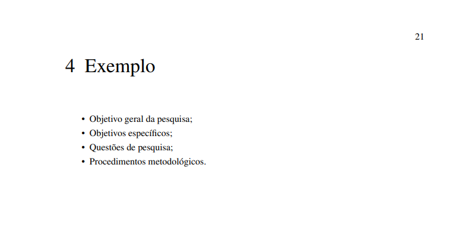

> **Nota:** No arquivo Markdown, não é necessário inserir ponto e vírgula (`;`) ao final de cada item nem ponto final (`.`) no último item, porque no template utilizado na geração do PDF, esses sinais são adicionados automaticamente na renderização final.

## Listas ordenadas numéricas

Use listas ordenadas quando os itens precisam seguir uma sequência.

Para criar uma lista numerada, escreva um número seguido de ponto e espaço.

**Exemplo:**

```md
1. Definir o problema de pesquisa
2. Formular as questões de pesquisa
3. Selecionar as bases de dados
4. Executar a estratégia de busca
5. Analisar os estudos selecionados
```

Você também pode repetir `1.` em todos os itens. A numeração será ajustada automaticamente na renderização final.

**Exemplo:**

```md
1. Definir o problema de pesquisa
1. Formular as questões de pesquisa
1. Selecionar as bases de dados
1. Executar a estratégia de busca
1. Analisar os estudos selecionados
```

Veja, na imagem abaixo, como essa lista é renderizada no PDF:

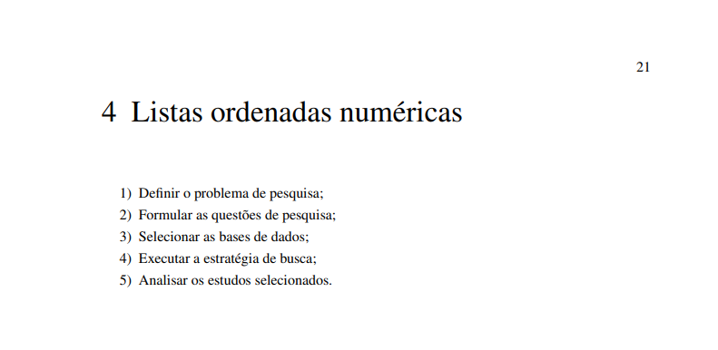

> **Nota:** Durante o processo de compilação, você vai perceber que a lista que antes estava sendo definida com `1.` vai ser exibida visualmente como `1)`. Só que isso não altera o funcionamento da lista.

## Listas ordenadas iniciando em outro número

Use esse formato quando a lista representar a continuação de uma sequência anterior.

**Exemplo:**

```md
5. Realizar a extração dos dados.
6. Organizar os resultados.
7. Interpretar as evidências.
8. Apresentar as conclusões.
```

Veja, na imagem abaixo, como essa lista é renderizada no PDF:

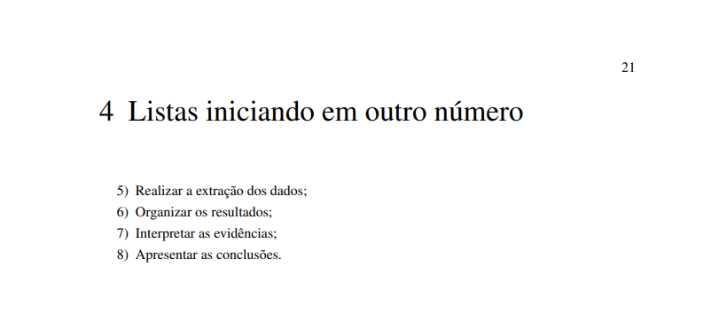

## Listas alfabéticas

:::warning

O suporte a listas alfabéticas depende da extensão `fancy_lists` do Pandoc, que não está habilitada por padrão no VixeText. Se a lista não for renderizada corretamente no PDF, consulte as seções [Observação para usuários avançados](#observação-para-usuários-avançados) e [Uso de LaTeX como último recurso](#uso-de-latex-como-último-recurso).

:::

Use listas alfabéticas para apresentar alternativas, categorias, critérios ou subitens.

**Exemplo com letras minúsculas:**

```md
a. Primeiro critério de inclusão.
b. Segundo critério de inclusão.
c. Terceiro critério de inclusão.
d. Quarto critério de inclusão.
```

**Exemplo com letras maiúsculas:**

```md
A.  Grupo de controle.
B.  Grupo experimental.
C.  Grupo de validação.
D.  Grupo de comparação.
```

> **Nota:** Em listas com letras maiúsculas seguidas de ponto, use dois espaços depois do marcador, como em `A.  Grupo de controle`. Isso evita ambiguidades durante a conversão do documento.

**Exemplo com letra entre parênteses:**

```md
(a) Objetivo geral.
(b) Objetivos específicos.
(c) Questões de pesquisa.
(d) Contribuições esperadas.
```

Veja, na imagem abaixo, como essa lista é renderizada no PDF:

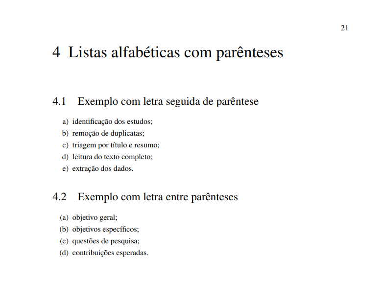

## Listas com marcador automático

Use `#.` quando quiser deixar a numeração automática sem precisar escrever os números manualmente.

**Exemplo:**

```md
#. Definição do tema
#. Formulação do problema
#. Elaboração das questões de pesquisa
#. Análise das evidências
```

Veja, na imagem abaixo, como essa lista é renderizada no PDF:

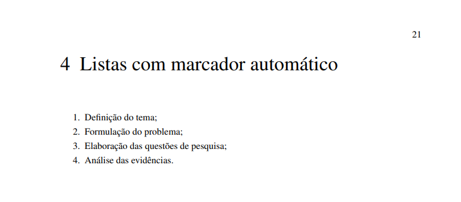

Esse recurso é útil quando você pretende adicionar, remover ou reorganizar itens com frequência.

## Listas com subitens

Listas podem conter subitens. Para isso, indente os itens internos com espaços.

**Exemplo:**

```md
1. Planejamento da pesquisa:
   a. Definição do tema.
   b. Formulação do problema.
   c. Elaboração das questões de pesquisa.

2. Condução da pesquisa:
   a. Execução da busca.
   b. Aplicação dos critérios de inclusão e exclusão.
   c. Extração dos dados.

3. Síntese dos resultados:
   a. Organização dos dados.
   b. Análise das evidências.
   c. Discussão das limitações.
```

Veja, na imagem abaixo, como essa lista é renderizada no PDF:

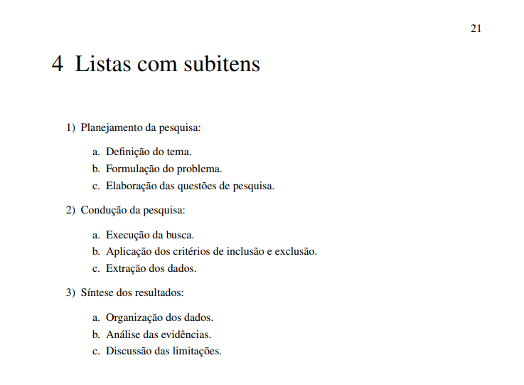

Também é possível combinar listas numeradas, alfabéticas e não ordenadas.

**Exemplo:**

```md
1. Critérios de inclusão:
   a. Estudos publicados em inglês.
   b. Estudos relacionados ao tema da pesquisa.
   c. Estudos com texto completo disponível.

2. Critérios de exclusão:
   - Estudos secundários.
   - Estudos duplicados.
   - Estudos fora do escopo.
   - Estudos sem informações metodológicas suficientes.
```

## Listas com múltiplos parágrafos

Um item de lista pode conter mais de um parágrafo. Para isso, deixe uma linha em branco e indente o parágrafo adicional.

**Exemplo:**

```md
1. O primeiro objetivo consiste em identificar os estudos relacionados ao tema da pesquisa.

   Esse objetivo permite compreender como a literatura tem tratado o problema investigado e quais abordagens aparecem com maior frequência.

2. O segundo objetivo consiste em classificar os estudos selecionados.

   A classificação ajuda a organizar os trabalhos por tipo de contribuição, método utilizado, contexto de aplicação e forma de avaliação.

3. O terceiro objetivo consiste em sintetizar as principais evidências encontradas.

   A síntese permite destacar tendências, lacunas e oportunidades para pesquisas futuras.
```

Veja, na imagem abaixo, como essa lista é renderizada no PDF:

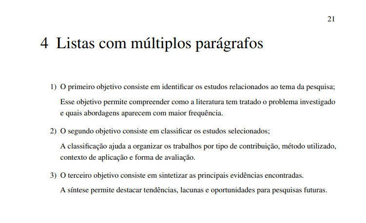

## Listas com outros elementos

Um item de lista também pode conter outros elementos, como citações, trechos de código ou expressões matemáticas.

**Exemplo:**

```md
1. Definição do problema:

   O problema de pesquisa deve ser apresentado de forma clara, indicando o contexto, a lacuna e a relevância do estudo \cite{fulano}.

2. Formulação da questão de pesquisa:

   > A questão de pesquisa orienta a coleta, a análise e a interpretação dos dados.

3. Exemplo de expressão matemática:

   A acurácia pode ser representada por \begin{math} \frac{acertos}{total} \end{math}.

```

Veja, na imagem abaixo, como essa lista é renderizada no PDF:

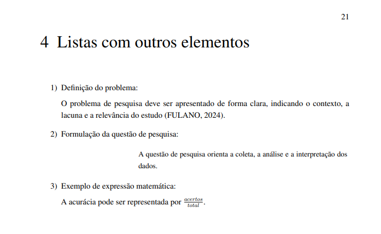

## Listas de exemplos numerados

Use listas de exemplos numerados quando precisar apresentar exemplos que podem ser referenciados ao longo do texto.

**Exemplo:**

```md
(@) Este é o primeiro exemplo numerado.

(@) Este é o segundo exemplo numerado.

(@) Este é o terceiro exemplo numerado.
```

Você também pode rotular um exemplo para citá-lo depois.

**Exemplo:**

```md
(@exemplo-protocolo) Este exemplo apresenta uma estrutura simples de protocolo de pesquisa.

Como ilustrado em (@exemplo-protocolo), exemplos numerados podem ser retomados em outras partes do texto.
```

Veja, na imagem abaixo, como essa lista é renderizada no PDF:

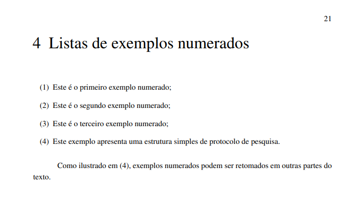

## Listas com algarismos romanos

Use listas com algarismos romanos quando quiser indicar etapas, categorias ou níveis de classificação.

```md
I) Fundamentação teórica.
II) Procedimentos metodológicos.
III) Resultados.
IV) Discussão.
V) Considerações finais.
```

Veja, na imagem abaixo, como essa lista é renderizada no PDF:

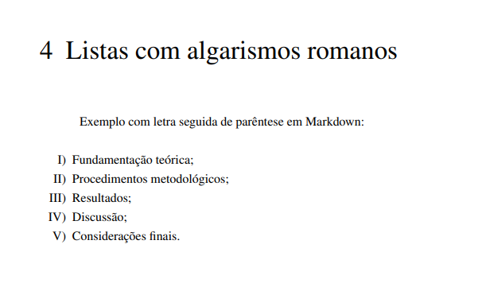

## Visualização no documento PDF

Ao compilar o documento em PDF, as listas são convertidas para o estilo visual definido pelo template.

Isso significa que o tipo lógico da lista é preservado, mas alguns marcadores podem aparecer com uma forma visual diferente. Por exemplo, uma lista escrita com `1.` pode aparecer como `1)`, e uma lista escrita com `a.` pode aparecer como `a)`.

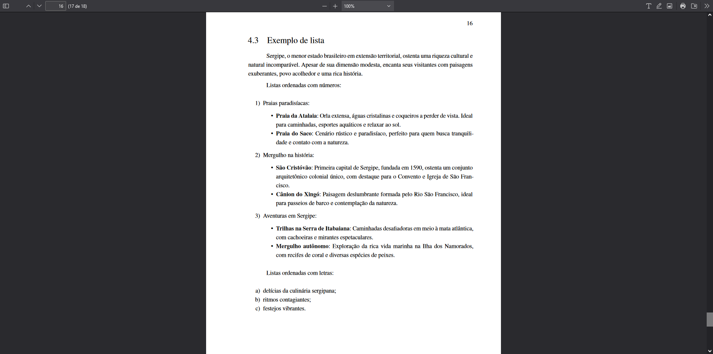

## Observação para usuários avançados

O VixeText utiliza internamente o [Limarka](https://github.com/abntex/limarka), uma ferramenta que converte documentos Markdown em PDFs formatados de acordo com as normas da ABNT. O Limarka, por sua vez, delega a conversão do Markdown para LaTeX ao [Pandoc](https://pandoc.org), um conversor de documentos amplamente utilizado na escrita acadêmica e técnica.

O Pandoc oferece um conjunto de **extensões** que ampliam a sintaxe padrão do Markdown. Cada extensão adiciona suporte a um tipo específico de elemento, como listas mais elaboradas, definições ou caixas de seleção. Por padrão, o Limarka invoca o Pandoc pelo [trabalho.rb](https://github.com/abntex/limarka/blob/95a786454f8e3db9db284ee9d4927a8c2c2f0aed/lib/limarka/trabalho.rb#L209) com o formato `markdown+raw_tex`, que habilita apenas a extensão `raw_tex`. Essa extensão específica é a responsável por permitir a inserção de código LaTeX diretamente no texto Markdown.

As demais extensões mencionadas nesta página **não estão habilitadas** por padrão nesse pipeline. Isso explica por que alguns recursos descritos aqui não funcionam apenas com Markdown no VixeText:

* `fancy_lists`: permite listas com marcadores alternativos, como letras (`a.`, `b.`);
* `task_lists`: converte a sintaxe `- [x]` e `- [ ]` em caixas de seleção;
* `definition_lists`: adiciona suporte a listas de definição (termo seguido de definição recuada).

A documentação oficial do Pandoc sobre extensões e listas está disponível em: https://pandoc.org/demo/example33/8.7-lists.html

Quando o recurso desejado não é suportado pelo pipeline padrão do VixeText, há duas alternativas: escrever o trecho diretamente em LaTeX (conforme descrito na seção a seguir) ou, se quiser manter tudo em Markdown, compilar o documento manualmente com o Pandoc habilitando as extensões necessárias. Nesse segundo caso, consulte a documentação do Pandoc para montar o comando adequado.

## Uso de LaTeX como último recurso

O objetivo do VixeText é permitir a escrita de documentos acadêmicos usando Markdown, sem exigir que você escreva LaTeX diretamente. Na maior parte dos casos, os tipos de lista descritos nesta página funcionam bem com a sintaxe Markdown apresentada nas seções anteriores.

No entanto, como explicado na seção de observações acima, algumas extensões do Pandoc não estão habilitadas no pipeline padrão do VixeText. Isso significa que certos comportamentos de lista, como garantir exatamente um rótulo personalizado ou forçar algarismos romanos maiúsculos, podem não ser reproduzidos com fidelidade apenas com Markdown. Nesses casos específicos, você pode recorrer ao LaTeX para ter controle total sobre a formatação.

**Quando usar:** Recorra ao LaTeX sempre que o Markdown não entregar o resultado esperado após a compilação. Por exemplo, se você precisa que as questões de pesquisa apareçam com os rótulos exatos `RQ1.`, `RQ2.` e `RQ3.` no PDF, a sintaxe Markdown de lista numerada não garante esse formato. Nessas situações, o LaTeX é a solução ideal:

```latex
\begingroup
\renewcommand{\labelenumi}{\textbf{RQ\arabic{enumi}.}}
\begin{enumerate}
\item Quais tarefas são apoiadas pelas abordagens identificadas?
\item Quais métodos são utilizados nos estudos selecionados?
\item Quais métricas são empregadas na avaliação dos resultados?
\end{enumerate}
\endgroup
```

Da mesma forma, utilize o código abaixo se precisar de rótulos textuais personalizados, como `Etapa 1:`, `Etapa 2:`, e assim por diante:

```latex
\begingroup
\renewcommand{\labelenumi}{\textbf{Etapa \arabic{enumi}:}}
\begin{enumerate}
\item Planejamento da pesquisa.
\item Execução da coleta de dados.
\item Análise e interpretação dos resultados.
\item Escrita e revisão do documento.
\end{enumerate}
\endgroup
```

### Listas com algarismos romanos maiúsculos

Como mencionado nas seções anteriores, a extensão `fancy_lists` não está habilitada por padrão. Isso significa que listas com algarismos romanos maiúsculos escritas em Markdown podem não ser reconhecidas corretamente durante a compilação em alguns cenários específicos. Se você encontrar dificuldades ao seguir os procedimentos em Markdown detalhados anteriormente, pode recorrer ao LaTeX como alternativa. Para garantir a saída correta, use:

```latex
\begingroup
\renewcommand{\labelenumi}{\Roman{enumi}.}
\begin{enumerate}
\item Fundamentação teórica.
\item Procedimentos metodológicos.
\item Resultados.
\item Discussão.
\item Considerações finais.
\end{enumerate}
\endgroup
```

Também é possível usar algarismos romanos maiúsculos com parêntese:

```latex
\begingroup
\renewcommand{\labelenumi}{\Roman{enumi})}
\begin{enumerate}
\item Fundamentação teórica.
\item Procedimentos metodológicos.
\item Resultados.
\item Discussão.
\item Considerações finais.
\end{enumerate}
\endgroup
```

Veja, na imagem abaixo, como essa lista é renderizada no PDF:


### Listas alfabéticas com ponto

Se você precisa que a lista apareça exatamente com ponto (`a.`, `b.`, `c.`) em vez de parêntese (`a)`), use LaTeX:

```latex
\begingroup
\renewcommand{\labelenumi}{\alph{enumi}.}
\begin{enumerate}
\item Primeiro critério de inclusão.
\item Segundo critério de inclusão.
\item Terceiro critério de inclusão.
\item Quarto critério de inclusão.
\end{enumerate}
\endgroup
```

Também é possível usar letras maiúsculas com ponto:

```latex
\begingroup
\renewcommand{\labelenumi}{\Alph{enumi}.}
\begin{enumerate}
\item Grupo de controle.
\item Grupo experimental.
\item Grupo de validação.
\item Grupo de comparação.
\end{enumerate}
\endgroup
```

Veja, na imagem abaixo, como essa lista é renderizada no PDF:

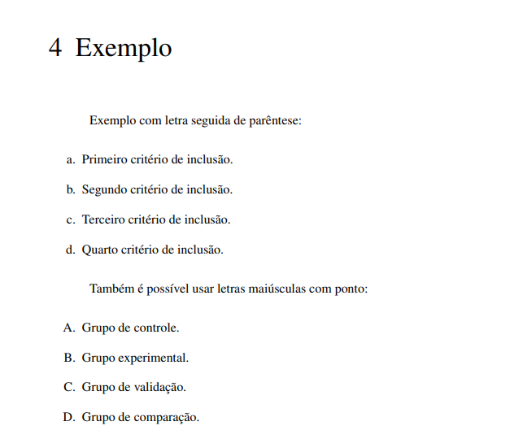

### Listas de tarefas

A sintaxe `- [x]` e `- [ ]` do Markdown depende da extensão `task_lists`, que não está habilitada por padrão. Para apresentar uma lista com caixas de seleção no PDF, use LaTeX:

```latex
\begin{itemize}
\item[\fbox{\scriptsize X}] Definir o tema do estudo.
\item[\fbox{\scriptsize X}] Elaborar o protocolo.
\item[\fbox{\phantom{\scriptsize X}}] Executar a busca nas bases.
\item[\fbox{\phantom{\scriptsize X}}] Aplicar os critérios de seleção.
\item[\fbox{\phantom{\scriptsize X}}] Escrever a seção de resultados.
\end{itemize}
```

Veja, na imagem abaixo, como essa lista é renderizada no PDF:

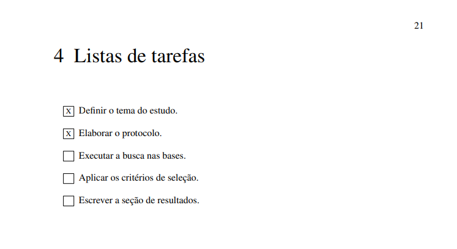

No geral, sempre que possível, prefira a sintaxe Markdown. Ela é mais simples, legível e fácil de manter. Recorra ao LaTeX apenas quando o resultado esperado não puder ser alcançado de outra forma.
