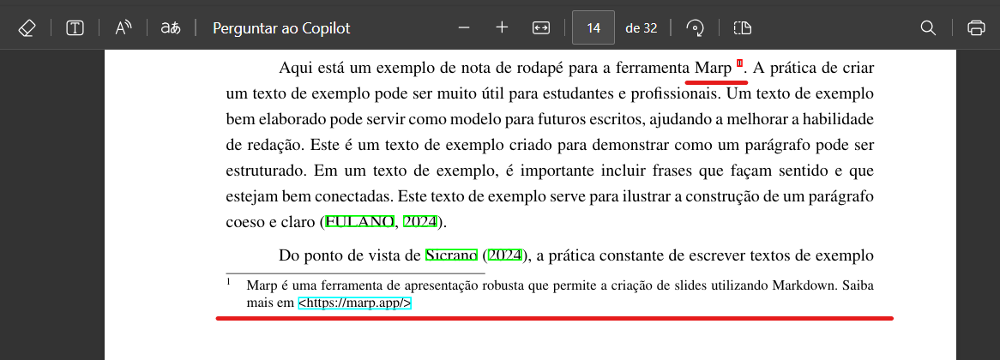

# Nota de rodapé

No projeto VixeText, a criação de uma nota de rodapé é feita diretamente no texto Markdown, permitindo referências rápidas e detalhadas sem interromper o fluxo principal da leitura.

## Como criar uma nota de rodapé

Para inserir uma nota de rodapé em seu documento, siga o seguinte formato:

1. Insira no texto onde deseja que apareça a referência numérica, usando a sintaxe:

```md
Aqui está um exemplo de referência para a ferramenta Marp [^marp].
```

2. Ao final do documento ou na parte dedicada às referências, defina o conteúdo da nota de rodapé utilizando a seguinte sintaxe:

```md
[^marp]: Marp é uma ferramenta de apresentação robusta que permite a criação de slides utilizando Markdown. Saiba mais em https://marp.app/
```

## Exemplo Completo

```md
Aqui está um exemplo de nota de rodapé para a ferramenta Marp [^marp]. A prática de criar um texto de exemplo pode ser muito útil para estudantes e profissionais.

[^marp]: Marp é uma ferramenta de apresentação robusta que permite a criação de slides utilizando Markdown. Saiba mais em [https://marp.app/](https://marp.app/)
```

Após a compilação do documento, o resultado será uma referência numerada que direciona o leitor para o conteúdo detalhado na parte inferior da página ou ao final do documento.

## Visualização final em documento PDF

Após compilação, a nota de rodapé é exibidas no documento PDF, veja o exemplo abaixo:



## Boas práticas

- Utilize notas de rodapé para informações adicionais, esclarecimentos breves ou referências externas.
- Evite usar notas de rodapé excessivamente para não comprometer a fluidez da leitura.

Dessa forma, a ferramenta simplifica a inclusão de notas explicativas e fontes adicionais, enriquecendo seus documentos com maior praticidade e clareza.
