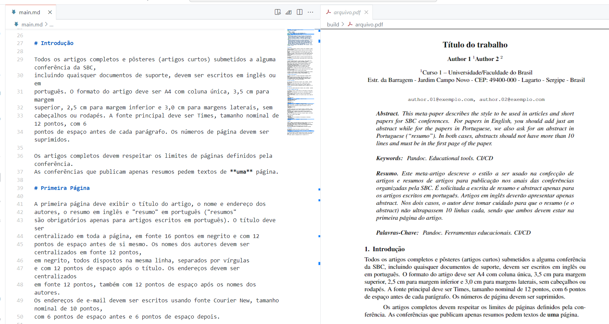

# Artigo SBC

:::warning

A compilação do documento no modelo da SBC ainda está em desenvolvimento. No entanto, você pode utilizar as versões experimentais para realizar testes.

:::

Atualmente, estamos iniciando o suporte para a escrita de trabalhos utilizando o modelo da SBC. Experimentos estão sendo conduzidos em um projeto isolado para, posteriormente, integrar essas configurações ao repositório principal. O objetivo é permitir que, com as novas atualizações, os usuários possam selecionar o modelo de trabalho desejado.

Veja abaixo um exemplo da compilação de um artigo no modelo da SBC, utilizando Markdown como base:

Conforme observado na imagem acima, a ferramenta já permite a compilação do Markdown para um PDF que segue as regras estabelecidas pela SBC. Se você tem interesse nessas funcionalidades, recomendo a leitura da documentação disponível no repositório abaixo:

- [Link para o repositório das configurações do template para SBC](https://github.com/ReinanHS/pandoc-template-sbc).

Dentro desse repositório, você encontrará todas as informações necessárias para utilizar o template, bem como as etapas a serem seguidas para o processo de compilação. Qualquer problema ou dúvida deve ser reportado por meio das issues no GitHub.
