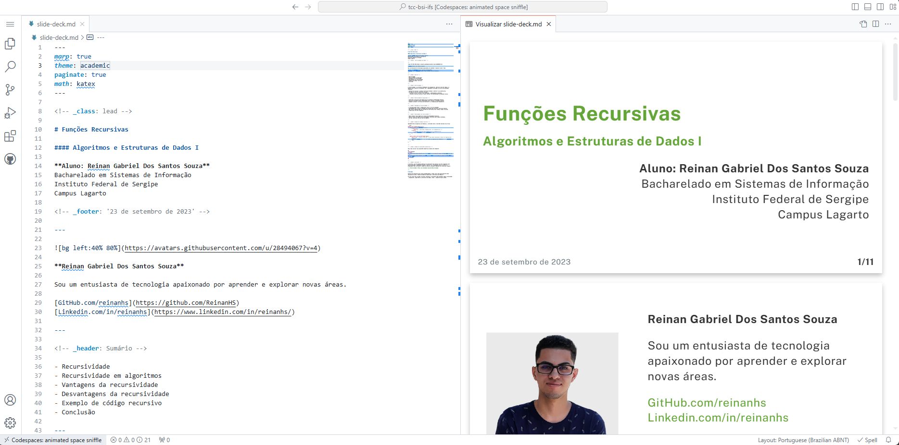

# Slide

Esta ferramenta também possibilita a criação de slides, oferecendo uma solução eficiente e integrada para a elaboração de apresentações acadêmicas. A utilização do Marp em conjunto com a nossa ferramenta permite que os usuários gerem slides diretamente a partir do conteúdo em Markdown, garantindo uma padronização consistente e evitando retrabalho na formatação.

Diferente de outras soluções que exigem edição manual e ajustes visuais frequentes, o Marp possibilita a automação da formatação dos slides, mantendo a coesão com o restante do material acadêmico e aumentando a produtividade do usuário. Veja abaixo um exemplo:

