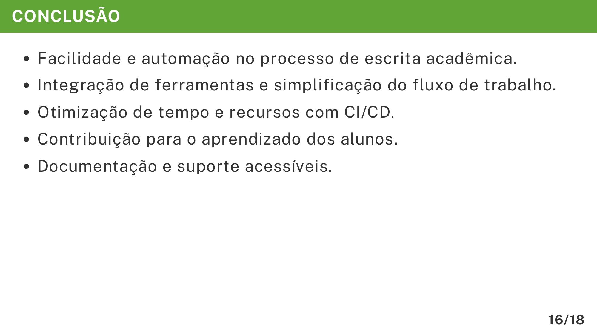

# Conclusão

A seção **Conclusão** da apresentação do TCC é o momento de encerrar sua narrativa com clareza e impacto, destacando os principais pontos positivos do trabalho desenvolvido e reforçando o valor da solução. É também a oportunidade de deixar para a banca e para o público uma mensagem final que consolide os resultados apresentados.

O exemplo abaixo mostra como estruturar a conclusão no Marp usando o template do VixeText:

```md
---

<!-- _header: CONCLUSÃO -->

- Facilidade e automação no processo de escrita acadêmica.
- Integração de ferramentas e simplificação do fluxo de trabalho.
- Otimização de tempo e recursos com CI/CD.
- Contribuição para o aprendizado dos alunos.
- Documentação e suporte acessíveis.
```

A imagem abaixo ilustra será exibida no documento final em PDF:



## Importância de cada detalhe

* **Título padronizado (`<!-- _header: CONCLUSÃO -->`)**: Mantém a consistência visual em toda a apresentação.
* **Lista de pontos-chave**: A apresentação em tópicos facilita a compreensão e evita excesso de texto.
* **Facilidade e automação**: Destacar melhorias práticas mostra o benefício direto para o usuário final.
* **Integração e simplificação**: Ressalta a eficiência obtida ao unificar processos e ferramentas.
* **Otimização com CI/CD**: Demonstra a aplicação de práticas modernas e eficientes de automação.
* **Contribuição para aprendizado**: Valoriza o impacto acadêmico e educacional da solução.
* **Documentação e suporte**: Indica preocupação com manutenção e acessibilidade da solução.

## Dicas para elaboração

1. **Seja sintético**: Mantenha frases curtas que resumam o resultado.
2. **Organize por relevância**: Liste os pontos do mais importante para o menos essencial.
3. **Conecte com os resultados**: A conclusão deve estar diretamente ligada aos dados e evidências apresentados.
4. **Evite informações inéditas**: Não introduza novos dados ou descobertas nesta parte.
5. **Finalize com impacto**: Escolha palavras que transmitam encerramento e solidez do trabalho.

Seguindo esse formato, o aluno conseguirá criar um slide de **Conclusão** que seja visualmente claro, direto e alinhado ao padrão do VixeText, transmitindo segurança e profissionalismo à banca.
