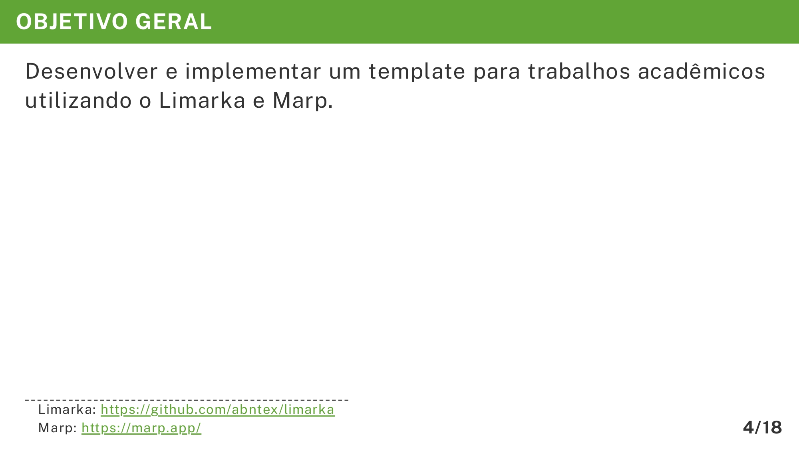

# Objetivo Geral

Nesta seção da apresentação do TCC, o **Objetivo Geral** tem a função de apresentar, de forma clara e direta, a meta principal que se pretende alcançar com o trabalho. É um dos elementos mais importantes da apresentação, pois ajuda a audiência a compreender rapidamente qual é o propósito central do estudo ou projeto.

O exemplo abaixo mostra como estruturar esse tópico no formato Markdown, utilizando o Marp e o template do VixeText:

```md
<!-- _header: OBJETIVO GERAL -->

Desenvolver e implementar um template para trabalhos acadêmicos utilizando o Limarka e Marp.

> Limarka: https://github.com/abntex/limarka
> Marp: https://marp.app/
```

A imagem abaixo ilustra será exibida no documento final em PDF:



## Importância de cada detalhe

* **Comentário de cabeçalho (`<!-- _header: OBJETIVO GERAL -->`)**: Indica o título do slide no Marp, garantindo consistência visual e facilitando a navegação durante a apresentação.
* **Enunciado objetivo e claro**: A frase "Desenvolver e implementar um template..." é direta e evita termos vagos. Isso transmite segurança e profissionalismo.
* **Referências aos projetos citados (Limarka e Marp)**: Inserir links diretos permite que a audiência ou avaliadores consultem as ferramentas mencionadas, demonstrando transparência e embasamento técnico.

## Dicas para elaboração

1. **Seja específico**: Evite frases genéricas como "Melhorar a educação". Prefira algo que detalhe o que será feito e qual tecnologia ou abordagem será utilizada.
2. **Use verbos no infinitivo**: Palavras como *desenvolver*, *analisar* e *implementar* deixam claro que se trata de uma ação planejada.
3. **Mantenha a objetividade**: Uma frase curta e bem estruturada é mais impactante que um parágrafo longo.
4. **Inclua referências quando possível**: Links ou menções a tecnologias, metodologias ou teorias fortalecem a credibilidade.
5. **Alinhe com o conteúdo do TCC**: O objetivo geral deve estar totalmente conectado ao problema apresentado e aos resultados esperados.

Seguindo esse modelo e essas dicas, o aluno conseguirá criar um slide claro, objetivo e visualmente consistente para apresentar o **Objetivo Geral** do seu TCC usando o Marp e o VixeText.
