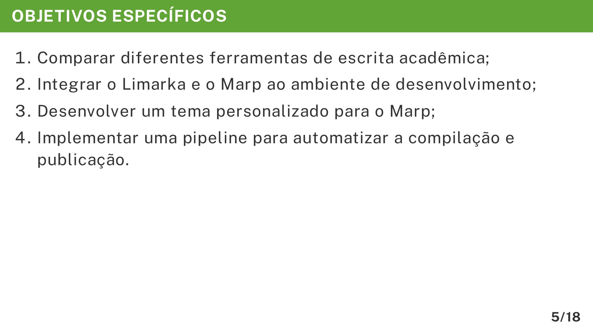

# Objetivos Específicos

Na apresentação do TCC, os **Objetivos Específicos** detalham as etapas e ações necessárias para atingir o **Objetivo Geral**. Eles funcionam como um desdobramento, mostrando o caminho que será percorrido ao longo do projeto.

O exemplo abaixo ilustra como organizar esse conteúdo no formato Markdown usando o Marp e o template do VixeText:

```md
---

<!-- _header: OBJETIVOS ESPECÍFICOS -->

1. Comparar diferentes ferramentas de escrita acadêmica;
1. Integrar o Limarka e o Marp ao ambiente de desenvolvimento;
1. Desenvolver um tema personalizado para o Marp;
1. Implementar uma pipeline para automatizar a compilação e publicação.
```

A imagem abaixo ilustra será exibida no documento final em PDF:



## Importância de cada detalhe

* **Comentário de cabeçalho (`<!-- _header: OBJETIVOS ESPECÍFICOS -->`)**: Garante que o slide tenha um título padronizado no Marp, facilitando a leitura e mantendo a consistência da apresentação.
* **Lista numerada**: Ajuda a organizar as ações de forma lógica e sequencial, facilitando para a audiência compreender a ordem das tarefas.
* **Verbos no infinitivo** (*Comparar*, *Integrar*, *Desenvolver*, *Implementar*)**:** Indicam ações claras e objetivas, reforçando o caráter prático das etapas.
* **Clareza e especificidade**: Cada objetivo descreve de forma direta o que será feito, evitando termos vagos ou genéricos.

## Dicas para elaboração

1. **Quebre o objetivo geral em partes menores**: Pense nas tarefas que precisam ser cumpridas para atingir a meta principal.
2. **Use entre 3 e 6 objetivos**: Quantidades muito grandes podem deixar o slide poluído e confundir a audiência.
3. **Mantenha a coerência com o TCC**: Cada objetivo específico deve estar diretamente ligado ao problema e ao objetivo geral.
4. **Prefira frases curtas e diretas**: Isso mantém o slide visualmente limpo e fácil de ler.
5. **Utilize ordem lógica ou cronológica**: Se possível, organize os objetivos na sequência em que serão executados.

Seguindo esse formato e essas orientações, o aluno conseguirá criar um slide de **Objetivos Específicos** bem estruturado, visualmente claro e totalmente alinhado com o restante da apresentação no Marp.
