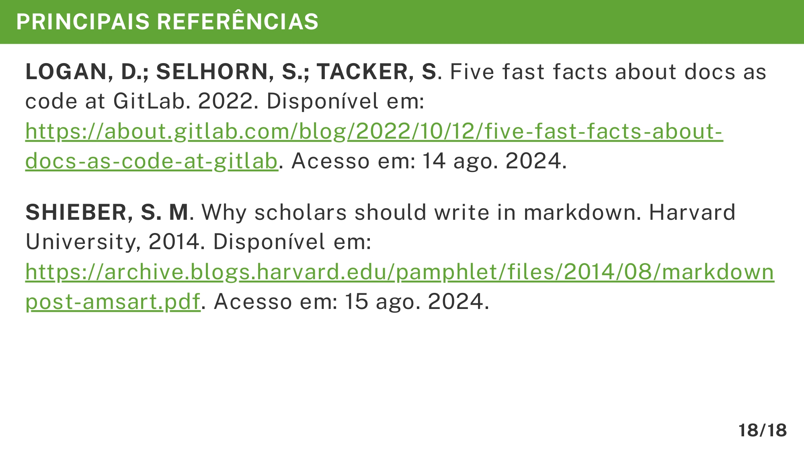

# Principais Referências

A seção **Principais Referências** na apresentação do TCC é responsável por evidenciar as fontes mais relevantes utilizadas no desenvolvimento do trabalho. Além de cumprir uma exigência acadêmica, essa parte reforça a credibilidade da pesquisa e demonstra o embasamento teórico adotado.

O exemplo abaixo mostra como estruturar essa seção no Marp com o template do VixeText:

```md
<!-- _header: PRINCIPAIS REFERÊNCIAS -->

**LOGAN, D.; SELHORN, S.; TACKER, S**. Five fast facts about docs as code at GitLab. 2022. Disponível em: https://about.gitlab.com/blog/2022/10/12/five-fast-facts-about-docs-as-code-at-gitlab. Acesso em: 14 ago. 2024.

**SHIEBER, S. M**. Why scholars should write in markdown. Harvard University, 2014. Disponível em: https://archive.blogs.harvard.edu/pamphlet/files/2014/08/markdownpost-amsart.pdf. Acesso em: 15 ago. 2024.
```

A imagem abaixo ilustra será exibida no documento final em PDF:



## Importância de cada detalhe

* **Título padronizado (`<!-- _header: PRINCIPAIS REFERÊNCIAS -->`)**: Mantém o alinhamento visual da apresentação.
* **Formatação dos autores**: Utilizar negrito para destacar os nomes facilita a identificação.
* **Detalhes completos da obra**: Inclui título, ano, fonte e endereço eletrônico (quando disponível), seguindo normas acadêmicas.
* **Data de acesso**: Fundamental para fontes online, indicando quando o conteúdo foi consultado.

## Dicas para elaboração

1. **Selecione apenas as mais relevantes**: Inclua de 2 a 5 referências diretamente ligadas ao tema.
2. **Use normas acadêmicas**: Siga o padrão adotado no TCC (por exemplo, ABNT) para manter consistência.
3. **Priorize fontes confiáveis**: Prefira artigos científicos, livros e materiais de instituições reconhecidas.
4. **Evite excesso de texto**: No slide, mantenha as referências enxutas e bem organizadas.
5. **Considere links clicáveis**: Ao gerar apresentações interativas, links diretos facilitam o acesso pela banca.

Seguindo essas orientações, o aluno conseguirá criar um slide de **Principais Referências** que seja claro, objetivo e alinhado às normas, reforçando a base teórica da pesquisa no padrão visual do VixeText no Marp.
