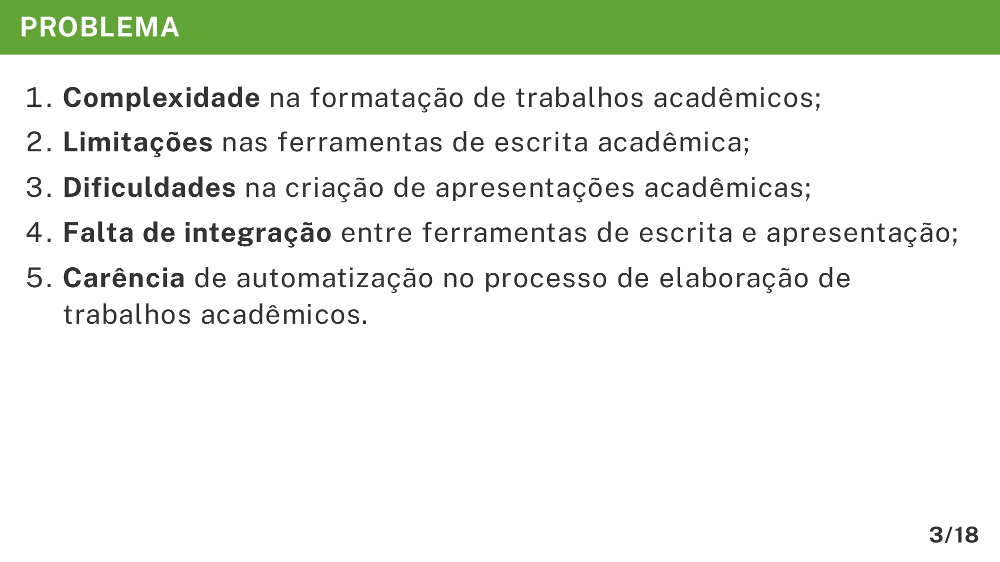

# Problema

A seção "Problema" é crucial para a sua apresentação do TCC, pois contextualiza e evidencia claramente as dificuldades ou questões que motivaram a sua pesquisa. Ao utilizar o Marp e o template VixeText, você consegue estruturar essa seção de maneira clara e visualmente atrativa, destacando pontos importantes para o entendimento do público.

## Importância da apresentação do problema

Destacar o problema de maneira clara e objetiva ajuda a audiência a compreender rapidamente a relevância e a necessidade do seu trabalho. Uma apresentação eficiente dos problemas identificados reforça o valor da sua pesquisa e cria uma conexão imediata com o público.

## Estrutura recomendada

Ao abordar o problema na sua apresentação, recomendamos destacar cada item com clareza e brevidade. A estrutura pode seguir os seguintes aspectos principais:

* **Complexidade**: Destaque quais são os desafios específicos que tornam o contexto problemático.
* **Limitações**: Pontue as restrições ou deficiências das ferramentas ou métodos atuais.
* **Dificuldades**: Identifique claramente as dificuldades práticas enfrentadas pelos usuários ou pesquisadores.
* **Falta de integração**: Realce a ausência de conexão eficiente entre diferentes ferramentas ou processos envolvidos.
* **Carência de automatização**: Mencione a importância de soluções automatizadas para eficiência e precisão na elaboração do trabalho acadêmico.

## Exemplo de apresentação do problema

Veja o exemplo prático para estruturar a seção "Problema" utilizando o Marp e o template do VixeText:

```md
---

<!-- _header: PROBLEMA -->

1. **Complexidade** na formatação de trabalhos acadêmicos;
1. **Limitações** nas ferramentas de escrita acadêmica;
1. **Dificuldades** na criação de apresentações acadêmicas;
1. **Falta de integração** entre ferramentas de escrita e apresentação;
1. **Carência** de automatização no processo de elaboração de trabalhos acadêmicos.

```

A imagem abaixo ilustra será exibida no documento final em PDF:



## Dicas importantes

* **Destaque visual com `_header`**: Utilize o cabeçalho `_header: PROBLEMA` para reforçar a importância visual e semântica dessa seção.
* **Uso de negrito**: Aplique o negrito para enfatizar termos-chave que identificam rapidamente os pontos críticos.
* **Listagem numerada**: Organize os problemas com numeração para indicar claramente a ordem ou a relevância dos itens.
* **Clareza e concisão**: Descreva cada ponto de forma clara e objetiva para facilitar a compreensão imediata da audiência.

Seguir essas orientações contribuirá significativamente para uma apresentação clara, organizada e que comunica eficientemente os desafios que o seu trabalho propõe solucionar.
