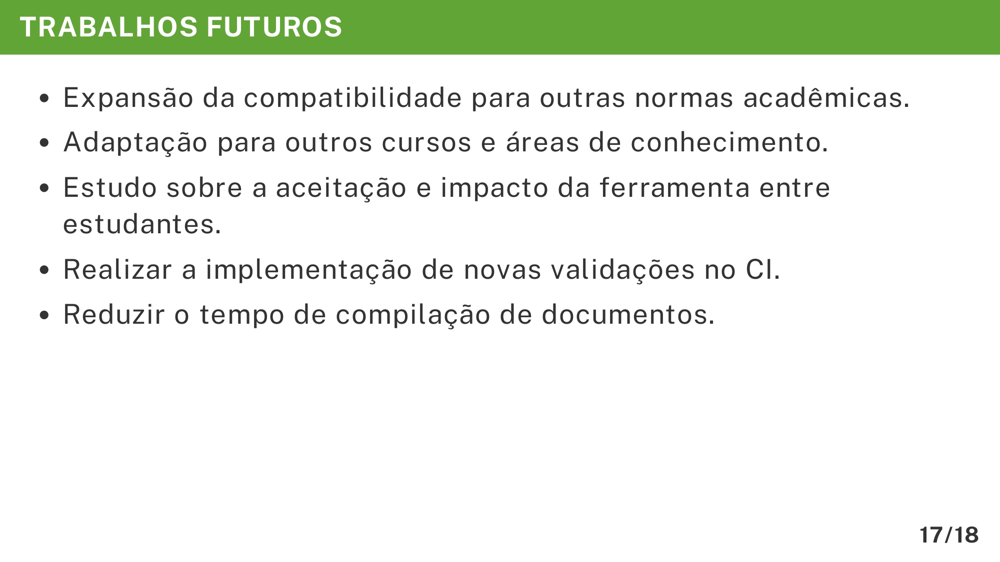

# Trabalhos Futuros

A seção **Trabalhos Futuros** na apresentação do TCC serve para indicar possibilidades de evolução e continuidade do projeto após a conclusão da pesquisa. Essa parte é importante porque demonstra que o trabalho não termina na entrega do TCC e que existem oportunidades de melhoria e expansão.

O exemplo abaixo mostra como estruturar essa seção no Marp com o template do VixeText:

```md
---

<!-- _header: TRABALHOS FUTUROS -->

- Expansão da compatibilidade para outras normas acadêmicas.
- Adaptação para outros cursos e áreas de conhecimento.
- Estudo sobre a aceitação e impacto da ferramenta entre estudantes.
- Realizar a implementação de novas validações no CI.
- Reduzir o tempo de compilação de documentos.
```

A imagem abaixo ilustra será exibida no documento final em PDF:



## Importância de cada detalhe

* **Título padronizado (`<!-- _header: TRABALHOS FUTUROS -->`)**: Mantém a consistência visual de toda a apresentação.
* **Lista de tópicos curtos**: Facilita a compreensão das futuras melhorias e evita excesso de texto.
* **Expansão de compatibilidade**: Mostra a visão de longo prazo para tornar a solução mais versátil.
* **Adaptação para novos contextos**: Demonstra potencial de aplicação em outras áreas.
* **Estudo de aceitação**: Indica preocupação com o impacto real da solução.
* **Novas validações no CI**: Aponta para melhorias técnicas no fluxo de automação.
* **Redução no tempo de compilação**: Mostra foco em eficiência e desempenho.

## Dicas para elaboração

1. **Mantenha-se realista**: Liste melhorias possíveis e alcançáveis.
2. **Seja específico**: Evite termos vagos como "melhorar a solução" e prefira ações concretas.
3. **Conecte com os resultados obtidos**: Mostre como os trabalhos futuros se baseiam no que foi desenvolvido.
4. **Use ordem estratégica**: Comece pelas melhorias mais relevantes ou prioritárias.
5. **Evite sobrecarregar o slide**: Foque nos trabalhos futuros mais significativos.

Seguindo esse modelo, o aluno conseguirá criar um slide de **Trabalhos Futuros** que transmita profissionalismo e visão estratégica, aproveitando a padronização e os recursos do template do VixeText no Marp.
