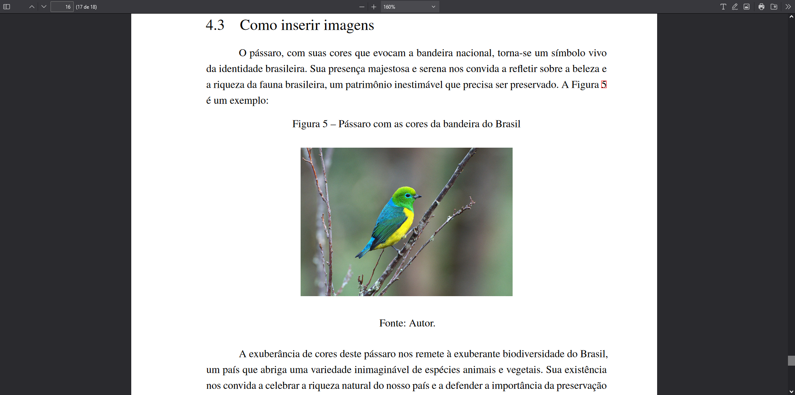

# Figuras

Figuras desempenham um papel crucial em documentos científicos, enriquecendo o texto com gráficos, ilustrações, desenhos, fotografias e outros materiais visuais que não se classificam como quadros ou tabelas. Elas podem ser inseridas em qualquer parte do documento para complementar e elucidar o conteúdo apresentado. Ao incluir figuras, é recomendável evitar o uso de imagens de altíssima resolução, a fim de não sobrecarregar o arquivo do documento.

## Exemplo de uso em markdown

Markdown oferece uma maneira eficiente de inserir figuras em documentos. A seguir, apresentamos um exemplo de como incluir uma figura usando a sintaxe Markdown:

```md
O pássaro, com suas cores que evocam a bandeira nacional, torna-se um símbolo vivo da identidade brasileira. Sua presença majestosa e serena nos convida a refletir sobre a beleza e a riqueza da fauna brasileira, um patrimônio inestimável que precisa ser preservado. A Figura \ref{passaro_exemplo} é um exemplo:

{#passaro_exemplo escala=0.4}

Fonte: Autor.

A exuberância de cores deste pássaro nos remete à exuberante biodiversidade do Brasil, um país que abriga uma variedade inimaginável de espécies animais e vegetais. Sua existência nos convida a celebrar a riqueza natural do nosso país e a defender a importância da preservação ambiental.
```

## Figura sintaxe do Markdown

Na inclusão de figuras, é essencial mencionar a fonte logo após a imagem. A largura da figura é opcional e determina o tamanho da imagem em relação à largura da página. Para referenciar a figura no texto, utilize `\autoref{rótulo}` com base no rótulo definido.

Exemplo de referência a uma figura:

```md
{#rotulo largura=100%}

Fonte: Autor.

Referenciando no texto: 
Ver \autoref{rotulo}.
Ou 
Ver Figura \ref{rotulo}.
```

## Utilização de snippets para figuras

O template inclui suporte para snippets no Visual Studio Code, facilitando a criação e formatação de figuras. Para usar um snippet específico para figuras, digite:

```text
lt:figura
```

e pressione `Ctrl + Espaço` para visualizar e selecionar snippets disponíveis. Isso exibirá os snippets disponíveis, incluindo aqueles específicos para a criação de figuras.


## Visualização em documento PDF

Ao serem compiladas em um documento PDF, as figuras mantêm sua formatação original, assegurando uma apresentação visual coerente e profissional.



Este guia sublinha a importância das figuras na elaboração de documentos científicos, oferecendo orientações detalhadas para sua inclusão, formatação e referenciamento, aproveitando as funcionalidades avançadas do template.
