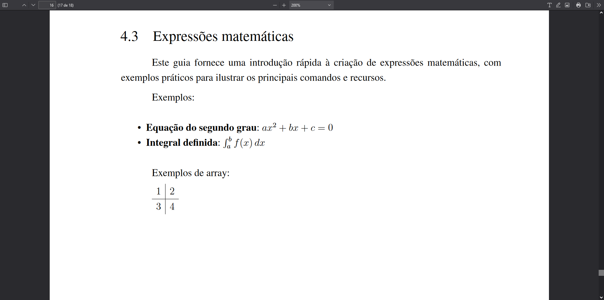

# Expressões matemáticas

LaTeX é amplamente reconhecido como um sistema de preparação de documentos de escolha na comunidade científica, devido à sua robusta capacidade de formatar expressões matemáticas complexas de forma precisa e elegante. Este guia destina-se a oferecer uma introdução concisa ao uso de LaTeX para a criação de expressões matemáticas, aproveitando os recursos do nosso template. Acompanhe os exemplos práticos para uma compreensão abrangente dos comandos e funcionalidades mais utilizados.

## Exemplo de uso em markdown

A utilização de expressões matemáticas em documentos pode ser exemplificada como segue:

```md
Exemplos:

- **Equação do segundo grau**: \begin{math} ax^2 + bx + c = 0 \end{math}
- **Integral definida**: \begin{math} \int_a^b f(x) \, dx \end{math}

Exemplos de array:

\begin{array}{c|c}
  1 & 2 \\
  \hline
  3 & 4
\end{array}
```

## Símbolos e operadores matemáticos

LaTeX oferece uma ampla gama de símbolos e operadores matemáticos para a elaboração de expressões matemáticas:

- Símbolos Gregos: Utilize comandos como `\alpha`, `\beta`, `\gamma`, entre outros, para representar símbolos gregos.
- Operadores Matemáticos: Incluem os operadores básicos `+`, `-`, `*`, `/`, assim como `^` para expoentes e `_` para índices.
- Funções Matemáticas: Funções como `\sin`, `\cos`, `\tan`, `\log` e outras são formatadas usando seus respectivos comandos LaTeX.

## Visualização em documento PDF

Ao serem incorporadas em um documento PDF, as expressões matemáticas formatadas com LaTeX mantêm sua precisão visual, garantindo que os dados sejam apresentados de maneira clara e profissional.



Este guia sublinha a importância das expressões matemáticas na documentação científica, fornecendo um caminho detalhado para sua elaboração e inclusão em documentos, maximizando as capacidades oferecidas pelo template.
