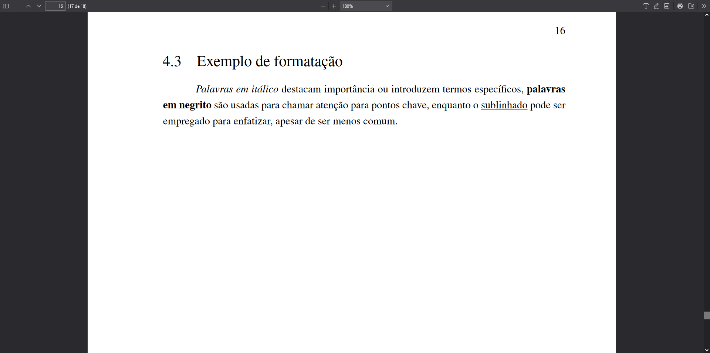

# Negrito, itálico e sublinhado

A formatação de texto é uma ferramenta poderosa para destacar informações críticas, organizar conceitos e melhorar a legibilidade de documentos científicos. O uso apropriado de estilos de texto como itálico, negrito e sublinhado pode significativamente influenciar a percepção e o entendimento do leitor. Esta seção aborda as práticas recomendadas para a aplicação dessas três técnicas de formatação em documentos.

## Formatação de texto

A aplicação de estilos de formatação como itálico, negrito e sublinhado contribui para a eficácia da comunicação escrita, permitindo que autores enfatizem pontos chave, diferenciem termos e guiem o leitor através de seus argumentos. A seguir, detalhamos o uso de cada uma dessas ferramentas de formatação.

### Itálico

O itálico é frequentemente utilizado para destacar palavras ou frases importantes, títulos de obras, expressões em língua estrangeira, ou quando se deseja enfatizar uma palavra específica.

### Negrito

O negrito é usado para chamar atenção para pontos críticos ou para indicar títulos e subtítulos, contribuindo para uma estruturação clara do documento.

### Sublinhado

Embora menos comum em textos científicos devido à sua semelhança visual com hiperlinks, o sublinhado pode ser empregado para enfatizar elementos específicos ou em cabeçalhos e títulos, quando apropriado.

## Exemplo de formatação

Para ilustrar o uso dessas formatações, considere o seguinte exemplo em Markdown, demonstrando itálico, negrito e sublinhado:

```md
*Palavras em itálico* destacam importância ou introduzem termos específicos, **palavras em negrito** são usadas para chamar atenção para pontos chave, enquanto o \underline{sublinhado} pode ser empregado para enfatizar, apesar de ser menos comum.
```

Para formatação de texto sublinhado, é necessário recorrer a comandos LaTeX adicionais, uma vez que Markdown nativamente não suporta sublinhado.

## Saída renderizada em PDF

A imagem a seguir exemplifica a renderização de texto formatado com itálico, negrito e sublinhado em um documento PDF. Observe a integração do Markdown com comandos LaTeX para alcançar a formatação desejada, demonstrando a versatilidade do Limarka em suportar diversas ferramentas de formatação.


