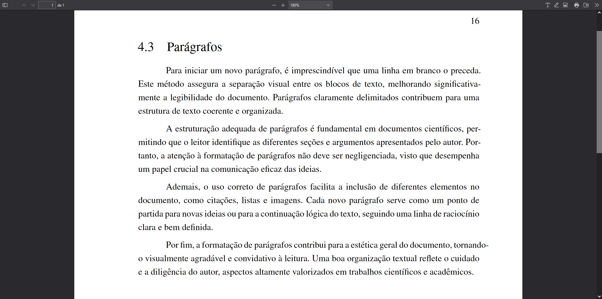

# Parágrafos

Esta seção descreve a formatação básica de parágrafos, essencial para a estruturação de documentos científicos. Para definir parágrafos, é necessário inserir uma linha em branco entre um bloco de texto e outro. Essa abordagem delimita o fim de um parágrafo e o início do seguinte, organizando o texto de maneira clara e legível. A seguir, apresentamos um exemplo prático dessa formatação.

## Exemplo

Considere o seguinte trecho de markdown para ilustrar a formatação de parágrafos em um documento:

```md
Para iniciar um novo parágrafo, é imprescindível que uma linha em branco o preceda. Este método assegura a separação visual entre os blocos de texto, melhorando significativamente a legibilidade do documento. Parágrafos claramente delimitados contribuem para uma estrutura de texto coerente e organizada.

A estruturação adequada de parágrafos é fundamental em documentos científicos, permitindo que o leitor identifique as diferentes seções e argumentos apresentados pelo autor. Portanto, a atenção à formatação de parágrafos não deve ser negligenciada, visto que desempenha um papel crucial na comunicação eficaz das ideias.

Ademais, o uso correto de parágrafos facilita a inclusão de diferentes elementos no documento, como citações, listas e imagens. Cada novo parágrafo serve como um ponto de partida para novas ideias ou para a continuação lógica do texto, seguindo uma linha de raciocínio clara e bem definida.

Por fim, a formatação de parágrafos contribui para a estética geral do documento, tornando-o visualmente agradável e convidativo à leitura. Uma boa organização textual reflete o cuidado e a diligência do autor, aspectos altamente valorizados em trabalhos científicos e acadêmicos.
```

## Saída renderizada em PDF

A imagem abaixo mostra como os parágrafos formatados conforme descrito acima são renderizados em um documento PDF. Observe a clara separação entre os blocos de texto, facilitando a leitura e compreensão do conteúdo.



Este exemplo demonstra a importância da correta formatação de parágrafos na criação de documentos científicos. Seguir estas diretrizes não só melhora a legibilidade do texto, mas também contribui para a qualidade e profissionalismo do documento final.
