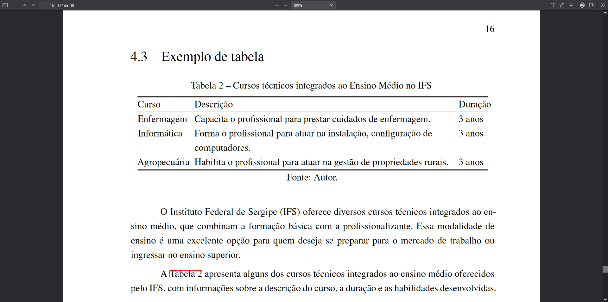

# Tabelas

Tabelas são componentes essenciais em documentos científicos, permitindo a apresentação de dados e informações de forma organizada e acessível. Este guia fornece instruções detalhadas para a criação de tabelas em documentos, utilizando a sintaxe Markdown e recursos específicos do template.

## Exemplo de uso em markdown

O Markdown oferece uma maneira simples e eficaz de criar tabelas que podem ser facilmente integradas em documentos científicos.

Para ilustrar a criação de uma tabela em Markdown, considere o exemplo a seguir, que detalha os cursos técnicos integrados ao Ensino Médio oferecidos pelo Instituto Federal de Sergipe (IFS):

```md
: Cursos técnicos integrados ao Ensino Médio no IFS \label{tabela_cursos}

| Curso        | Descrição                                                                    | Duração |
|--------------|------------------------------------------------------------------------------|---------|
| Enfermagem   | Capacita o profissional para prestar cuidados de enfermagem.                 | 3 anos  |
| Informática  | Forma o profissional para atuar na instalação, configuração de computadores. | 3 anos  |
| Agropecuária | Habilita o profissional para atuar na gestão de propriedades rurais.         | 3 anos  |

Fonte: Autor.

O Instituto Federal de Sergipe (IFS) oferece diversos cursos técnicos integrados ao ensino médio, que combinam a formação básica com a profissionalizante. Essa modalidade de ensino é uma excelente opção para quem deseja se preparar para o mercado de trabalho ou ingressar no ensino superior.

A \autoref{tabela_cursos} apresenta alguns dos cursos técnicos integrados ao ensino médio oferecidos pelo IFS, com informações sobre a descrição do curso, a duração e as habilidades desenvolvidas.
```

## Referência cruzada de tabelas

Com a definição de um label `\label{nome_para_sua_tabela}`, é possível referenciar tabelas em qualquer parte do texto utilizando `\autoref{nome_para_sua_tabela}`. Isso cria um link clicável, redirecionando o leitor diretamente para a tabela referenciada.

## Utilização de snippets para tabelas

O template oferece suporte a snippets no Visual Studio Code, facilitando a criação e formatação de tabelas. Para usar um snippet de tabela, digite:

```text
lt:tabela
```

e pressione `Ctrl + Espaço` para visualizar e selecionar snippets disponíveis.


## Formatação automática

O template está configurado para recomendar extensões que permitem a formatação automática de tabelas em Markdown. Utilizando estas extensões, você pode formatar tabelas rapidamente, evitando inconsistências e melhorando a legibilidade.

## Visualização em documento PDF

Quando compiladas em um documento PDF, as tabelas mantêm sua formatação e estrutura, assegurando uma apresentação clara e profissional dos dados. A seguir, apresentamos uma visualização de como a tabela do exemplo acima é renderizada em um documento PDF.



Este guia destaca a importância das tabelas na documentação científica e fornece uma abordagem detalhada para a criação, formatação e referência de tabelas em documentos, utilizando as funcionalidades avançadas do template.
