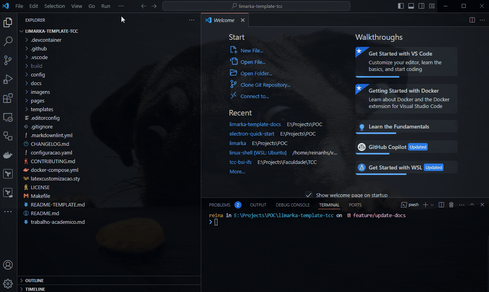

# Compilação

Este guia detalha as duas maneiras rápidas disponíveis para compilar documentos utilizando o Limarka Template no Visual Studio Code e via linha de comando, incluindo a adaptação para o ambiente do GitHub Codespaces.

## Compilação usando Visual Studio Code

O Visual Studio Code permite compilar o documento diretamente por meio de uma task configurada chamada "Limarka Builder". Segue abaixo o passo a passo para executar essa task e compilar o documento.

### Executando a task

1. **Abra o projeto no Visual Studio Code**: Certifique-se de que o diretório do projeto Limarka está aberto no VSCode.
1. **Acesse a view de tasks**:
   - Você pode abrir a view de tasks de várias maneiras:
     - Use o atalho `Ctrl+Shift+P` para abrir a paleta de comandos, digite `Tasks: Run Task` e selecione-o.
     - Vá até o menu `Terminal` na barra superior, escolha `Run Task`.
1. **Escolha a task Limarka Builder**:
   - Uma lista de tasks configuradas aparecerá. Selecione `Limarka Builder` para iniciar a compilação do documento.
   - Esta task executa um script específico que está configurado no arquivo `tasks.json` do projeto.
1. **Acompanhe a execução**:
   - A execução do script será mostrada no terminal integrado do VSCode. Quaisquer erros ou mensagens de sucesso serão exibidos aqui.

Veja a imagem abaixo de exemplificação:



### Detalhes da task

A task `Limarka Builder` está configurada para executar scripts diferentes dependendo do sistema operacional:

- **Linux e macOS**: Executa `sh .vscode/scripts/builder.sh`.
- **Windows**: Executa `.vscode/scripts/builder.bat`.

Estes scripts são responsáveis por iniciar o processo de compilação que transforma o conteúdo do template em um documento finalizado, como um PDF.

## Compilação via linha de comando

Além da compilação via Visual Studio Code, você também pode compilar o documento usando comandos Docker diretamente na raiz do projeto.

### Comandos para compilação

Execute os seguintes comandos no terminal:

```bash
docker-compose up
docker exec -it limarka-app /bin/bash -c "limarka-help"
```

Estes comandos realizam o seguinte:

- `docker-compose up`: Levanta o ambiente Docker configurado para o projeto.
- `docker exec -it limarka-app /bin/bash -c "limarka-help"`: Executa o comando `limarka-help` dentro do contêiner Docker, que é responsável pela compilação do documento.

### Uso no GitHub Codespaces

Se você está utilizando o GitHub Codespaces, a compilação pode ser ainda mais direta:

- **Abrir o Terminal**: Dentro do ambiente Codespaces, abra o terminal.
- **Executar o Comando de Compilação**:
  - Simplesmente digite `limarka-help` no terminal.
  - Este comando automaticamente compila o documento, pois o ambiente já está configurado para utilizar Docker implicitamente.

## Observações finais

Ao seguir estes métodos, você pode facilmente compilar seu documento acadêmico utilizando o Limarka Template em diferentes ambientes de desenvolvimento. Lembre-se de verificar se todas as dependências, como Docker e Visual Studio Code, estão corretamente instaladas e configuradas em sua máquina para garantir que a compilação ocorra sem problemas.
