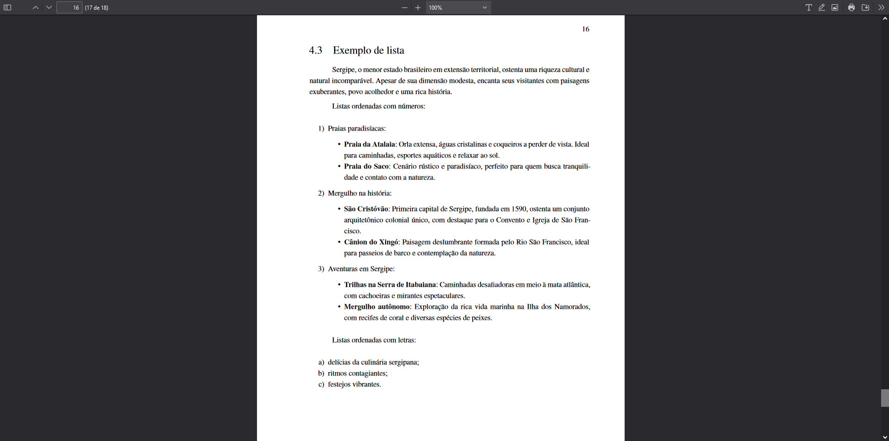

# Listas

Listas são ferramentas essenciais na redação de documentos científicos, permitindo a organização clara de informações em forma sequencial ou por categorias. Este guia aborda a criação e personalização de listas usando Markdown, destacando-se pela facilidade de implementação e flexibilidade.

## Tipos de listas

Veja abaixo os principais tipos de listas:

### Listas não ordenadas

Listas não ordenadas são ideais para apresentar itens sem uma sequência específica de importância. Para criar uma lista não ordenada em Markdown, utilize o símbolo de hífen `-` seguido de um espaço antes de cada item.

Exemplo de lista não ordenada:

```md
- Objetivo 1;
- Objetivo 2;
- Objetivo 3.
```

### Listas ordenadas

Listas ordenadas são utilizadas quando os itens precisam seguir uma ordem específica, seja numérica ou alfabética.

#### Com números

Para criar uma lista ordenada numericamente, inicie cada item com um número seguido de um ponto e um espaço.

```md
1. Primeiro item da lista;
2. Segundo item da lista;
3. Terceiro item da lista.
```

#### Com letras

Embora o Markdown padrão não suporte diretamente listas ordenadas alfabéticas, é possível simular esse efeito com formatação adicional ou usar extensões específicas que suportem tal funcionalidade.

```md
a. Primeiro item da lista;
b. Segundo item da lista;
c. Terceiro item da lista.
```

## Exemplo de uso em markdown

As listas podem ser enriquecidas com subitens, formatação em negrito ou itálico e outros elementos para destacar informações importantes ou organizar detalhes de maneira hierárquica.

```md
Listas ordenadas numericamente:

1. Pontos de interesse:
   - **Praia da Atalaia**: Excelente para atividades ao ar livre.
   - **Praia do Saco**: Ideal para relaxamento e contato com a natureza.
2. História e cultura:
   - **São Cristóvão**: Rica em patrimônio histórico.
   - **Cânion do Xingó**: Oferece paisagens naturais impressionantes.
3. Aventuras ecológicas:
   - **Trilhas na Serra de Itabaiana**: Para os amantes da natureza.
   - **Mergulho autônomo**: Exploração marinha na Ilha dos Namorados.

Listas alfabéticas:

a. Gastronomia local
b. Música regional
c. Tradicionais festividades

```

Nota-se que, ao utilizar o número `1.` para todos os itens de uma lista ordenada numericamente em Markdown, a ferramenta automaticamente ajusta a numeração, simplificando a edição e manutenção do documento.

## visualização em documento PDF

A representação visual das listas, quando compiladas em um documento PDF, demonstra a eficácia da estruturação de conteúdo, proporcionando uma leitura fluida e organizada.



Este guia demonstra a flexibilidade e simplicidade na criação de listas usando Markdown, técnicas valiosas para a elaboração de documentos científicos claros e bem estruturados.
