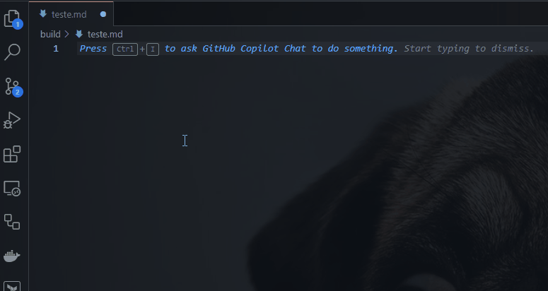
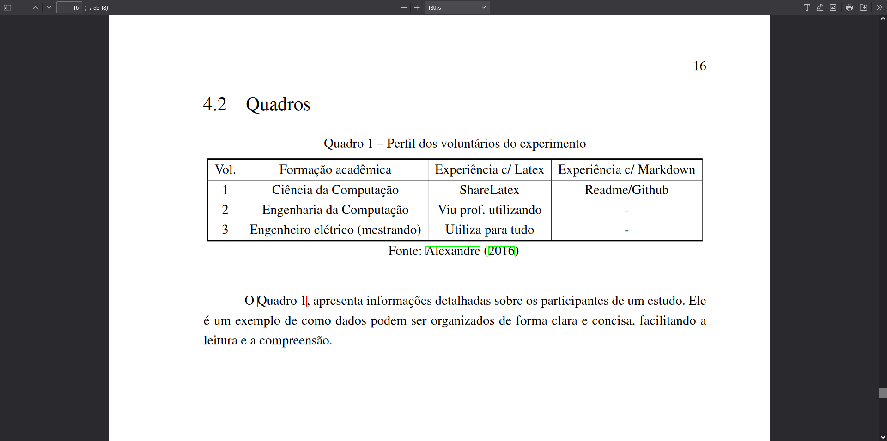

# Quadros

Quadros são elementos estruturais importantes em documentos científicos, utilizados para apresentar dados de forma organizada, geralmente dentro do contexto de referencial teórico, embora também possam ser empregados para exibir resultados de pesquisa. Este guia detalha o processo de criação e formatação de quadros, utilizando a sintaxe Markdown, dentro do âmbito de um template específico para a escrita científica.

## Exemplo de uso em markdown

O Markdown facilita a criação de quadros, que são essencialmente tabelas fechadas, utilizadas para organizar e apresentar dados secundários ou resultados de pesquisa de maneira clara e concisa.

Para exemplificar a criação de um quadro em Markdown, observe o seguinte exemplo, que detalha o perfil dos voluntários de um experimento:

```md
Quadro quadro_exemplo: Perfil dos voluntários do experimento

| Vol. |       Formação acadêmica        | Experiência c/ Latex | Experiência c/ Markdown |
|:----:|:-------------------------------:|:--------------------:|:----------------------:|
|  1   |      Ciência da Computação      |      ShareLatex      |     Readme/Github      |
|  2   |    Engenharia da Computação     | Viu prof. utilizando |           -            |
|  3   | Engenheiro elétrico (mestrando) |  Utiliza para tudo   |           -            |

Fonte: \citeonline{limarka}

O \autoref{quadro_exemplo}, apresenta informações detalhadas sobre os participantes de um estudo. Ele é um exemplo de como dados podem ser organizados de forma clara e concisa, facilitando a leitura e a compreensão.
```

## Referência cruzada

A criação eficaz de um quadro requer uma estruturação que facilite sua referência cruzada dentro do documento. No exemplo `Quadro quadro_exemplo: Perfil dos Voluntários do Experimento`, a identificação e a referência ao quadro são simplificadas pelo uso de uma etiqueta clara e pela adoção de uma nomenclatura consistente, utilizando-se `\autoref{quadro_exemplo}` para referenciá-lo no texto.

## Utilização de snippets para quadros

O template proporciona suporte a snippets no Visual Studio Code, agilizando a criação e formatação de quadros. Para acessar um snippet de quadro, digite:

```text
lt:quadro
```

e pressione `Ctrl + Espaço` para visualizar e selecionar snippets disponíveis. Isso exibirá os snippets disponíveis, incluindo aqueles específicos para a criação de quadros.



## Formatação automática

Para otimizar a formatação de quadros, o template recomenda extensões capazes de automatizar este processo em Markdown, garantindo consistência e melhorando a legibilidade do documento.

## Visualização em documento PDF

A transição de um quadro formatado em Markdown para sua representação em um documento PDF preserva sua estrutura e formatação, garantindo uma apresentação profissional dos dados compilados.



Este guia demonstra a importância dos quadros na composição de documentos científicos, oferecendo um roteiro detalhado para sua elaboração, formatação e referenciamento, aproveitando as funcionalidades avançadas oferecidas pelo template.
