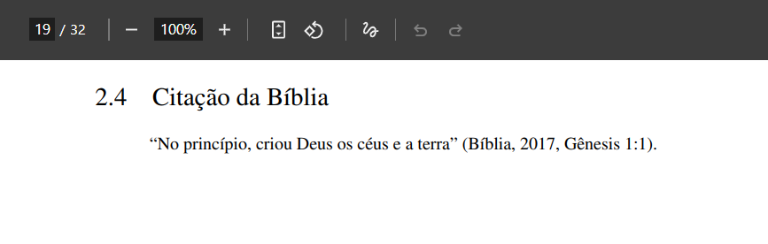

# Citação da Bíblia

A citação da Bíblia possui características específicas segundo a **ABNT NBR 10520:2023**. Como se trata de uma obra clássica e comumente disponível em diversas versões e traduções, é necessário indicar claramente o livro, capítulo e versículo citado, além da versão utilizada.

## Como fazer a citação da Bíblia

As citações bíblicas devem trazer:

* Nome do livro (abreviado ou por extenso, conforme o estilo do trabalho);
* Capítulo e versículo (separados por dois pontos);
* Tradução utilizada (na primeira citação ou quando for relevante).

**Exemplo:**

```md
"No princípio, criou Deus os céus e a terra" \cite[Gênesis 1:1]{bibliaNAA}.
```

No exemplo acima, temos a referência ao livro (Gênesis), capítulo (1), versículo (1) e a versão usada (Bíblia Almeida).


Veja a configuração para o [BibTeX](/criando-um-documento/elementos-pos-textuais/referencias):

```bib
@book{bibliaNAA,
  title        = {A Bíblia Sagrada: Nova Almeida Atualizada},
  author       = {{Bíblia}},
  year         = {2017},
  address      = {São Paulo},
  publisher    = {Sociedade Bíblica do Brasil},
  note         = {Nova Almeida Atualizada}
}
```

A imagem abaixo ilustra como a citação da Bíblia será exibida no documento final em PDF:



## Citação com mais de um versículo

Para citar mais de um versículo consecutivo, utilize um hífen para indicar o intervalo:

**Exemplo:**

```md
"O Senhor é o meu pastor; nada me faltará" \cite[Salmos 23:1-2]{bibliaNAA}.
```

## Referências

> N. JULIANA. *Como referenciar a Bíblia nas normas ABNT em trabalhos acadêmicos*. MyStudyBay, 21 maio 2025. Disponível em: [https://mystudybay.com.br/como-referenciar-a-biblia](https://mystudybay.com.br/como-referenciar-a-biblia). Acesso em: 30 jul. 2025.

> UNIVERSIDADE ESTADUAL PAULISTA “Júlio de Mesquita Filho”. *Manual de normalização de trabalhos acadêmicos: citação e referência: ABNT*. Grupo de Normas Técnicas Documentais, 2023. Disponível em: [https://www.fclar.unesp.br/Home/Biblioteca/normasparapublicacoes/abnt-atualizado-fev-2024.pdf](https://www.fclar.unesp.br/Home/Biblioteca/normasparapublicacoes/abnt-atualizado-fev-2024.pdf). Acesso em: 30 jul. 2025.
