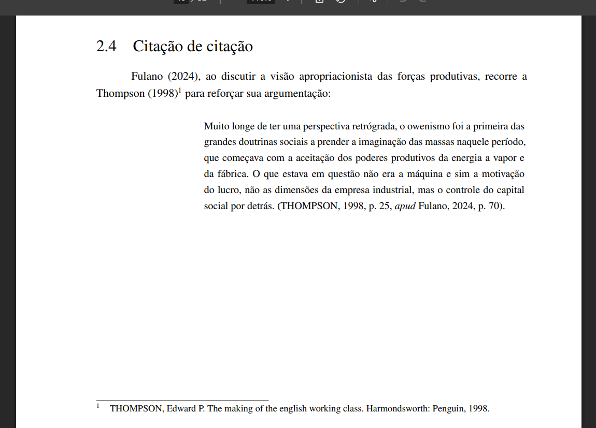

# Citação de citação

Em trabalhos acadêmicos, a citação de citação é utilizada quando o autor deseja referenciar uma obra que não foi consultada diretamente, mas sim mencionada por outro autor. Nesse caso, deve-se indicar o sobrenome do autor original, seguido pela expressão latina "*apud*", que significa "*citado por*" ou "*conforme*", e, em seguida, o sobrenome do autor efetivamente consultado.

É recomendado incluir a referência completa da obra original citada em uma nota de rodapé, garantindo maior clareza e facilitando consultas futuras.

## Exemplo de utilização

Veja um exemplo prático de como realizar a citação de citação no VixeText:

```md
\citeonline{fulano}, ao discutir a visão apropriacionista das forças produtivas, recorre a \citeonline{thompson}[^thompson] para reforçar sua argumentação:

> Muito longe de ter uma perspectiva retrógrada, o owenismo foi a primeira das grandes doutrinas sociais a prender a imaginação das massas naquele período, que começava com a aceitação dos poderes produtivos da energia a vapor e da fábrica. O que estava em questão não era a máquina, e sim a motivação do lucro; não as dimensões da empresa industrial, mas o controle do capital social por detrás. \cite[p. 25, \textit{apud} Fulano, 2024, p. 70]{thompson}.

[^thompson]: THOMPSON, Edward P. *The making of the English working class.* Harmondsworth: Penguin, 1998.
```

### Resultado visual

A figura abaixo demonstra como a citação de citação será exibida após a compilação em PDF:



## Referência

> ESPM. *Citação da citação*. Normas ABNT, 8 ago. 2023. Disponível em: [https://normas-abnt.espm.br/index.php?title=Cita%C3%A7%C3%A3o_da_cita%C3%A7%C3%A3o](https://normas-abnt.espm.br/index.php?title=Cita%C3%A7%C3%A3o_da_cita%C3%A7%C3%A3o). Acesso em: 30 jul. 2025.

> UNIVERSIDADE ESTADUAL PAULISTA “Júlio de Mesquita Filho”. *Manual de normalização de trabalhos acadêmicos: citação e referência: ABNT*. Grupo de Normas Técnicas Documentais, 2023. Disponível em: [https://www.fclar.unesp.br/Home/Biblioteca/normasparapublicacoes/abnt-atualizado-fev-2024.pdf](https://www.fclar.unesp.br/Home/Biblioteca/normasparapublicacoes/abnt-atualizado-fev-2024.pdf). Acesso em: 30 jul. 2025.
