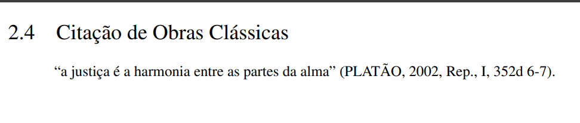

# Citação de Obras Clássicas

A **citação de obras clássicas** segue orientações específicas da **ABNT NBR 10520:2023**. Essas obras, por serem de domínio público e comumente publicadas em diferentes edições, exigem cuidados especiais para garantir a clareza quanto à origem e versão utilizada. É fundamental indicar a **edição consultada**, o **autor**, e quando necessário, informações adicionais como tradutor e ano da publicação da edição utilizada.

## Como fazer a citação de obras clássicas

Ao citar obras clássicas, devem ser informados:

* Autor original (com o ano da edição utilizada);
* Quando pertinente, o nome do tradutor ou organizador;
* Edição consultada (caso não seja a primeira);
* Trecho ou localização (página, capítulo, canto, ato etc.).

**Exemplo:**

```md
"a justiça é a harmonia entre as partes da alma" \cite[Rep., I, 352d 6-7]{platao2002}.
```

No exemplo acima, temos uma frase atribuída a Protágoras, registrada por Platão na edição consultada.

Veja a configuração para o [BibTeX](/criando-um-documento/elementos-pos-textuais/referencias):

```bib
@book{platao2002,
  author       = {Plat{\~a}o},
  title        = {A República},
  year         = {2002},
  address      = {Rio de Janeiro},
  publisher    = {Editora Best Seller},
  note         = {Tradução de Enrico Corvisieri}
}
```

A imagem abaixo ilustra como a citação de uma obra clássica será exibida no documento final em PDF:



## Referências

> AVENDAÑO, Diego. *Como citar: Platão*. Diego Avendaño, 9 jul. 2017. Disponível em: [https://diavendano.me/2017/07/09/como-citar-platao/](https://diavendano.me/2017/07/09/como-citar-platao/).

> COMO referenciar corretamente obras e autores da Antiguidade e Medievo?. LIMES – Fronteiras Interdisciplinares da Antiguidade e suas Representações, 2020. Disponível em: [https://limes.ufes.br/sites/proaera.ufes.br/files/field/anexo/como_referenciar_corretamente_obras_e_autores_da_antiguidade_e_medievo__1.pdf](https://limes.ufes.br/sites/proaera.ufes.br/files/field/anexo/como_referenciar_corretamente_obras_e_autores_da_antiguidade_e_medievo__1.pdf)
