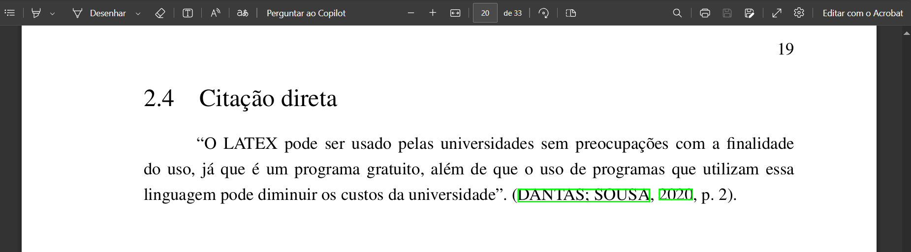
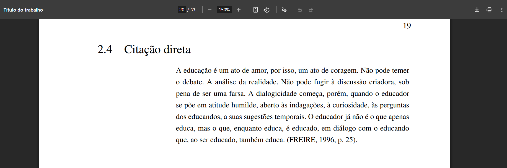
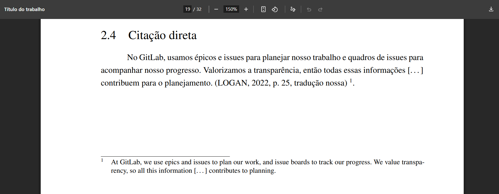

# Citação Direta

A citação direta é a transcrição literal de parte da obra de um autor consultado, respeitando fielmente a grafia, pontuação e estilo do texto original. De acordo com a norma ABNT NBR 10520, existem diferentes formas de apresentação de citação direta, conforme o tamanho e o contexto da transcrição. Abaixo, detalhamos cada uma delas com exemplos.

## Citação direta com menos de quatro linhas

Quando a citação direta tiver até três linhas, ela deve ser incorporada ao parágrafo, entre aspas duplas. Caso haja uma citação dentro da citação, esta última deve ser indicada com aspas simples. Deve-se indicar o autor, o ano e a página.

**Exemplo:**

```md
"O LATEX pode ser usado pelas universidades sem preocupações com a finalidade do uso, já que é um programa gratuito, além de que o uso de programas que utilizam essa linguagem pode diminuir os custos da universidade”. \cite[p. 2]{dantas}.
```

A imagem abaixo ilustra como a citação direta com menos de quatro linhas será exibida no documento final em PDF:



## Citação direta com quatro ou mais linhas

Se a citação direta tiver quatro linhas ou mais, deve ser destacada em parágrafo próprio, com recuo de 4 cm da margem esquerda, fonte menor que a do texto, espaçamento simples e sem aspas.

**Exemplo:**

```md
> A educação é um ato de amor, por isso, um ato de coragem. Não pode temer o debate. A análise da realidade. Não pode fugir à discussão criadora, sob pena de ser uma farsa. A dialogicidade começa, porém, quando o educador se põe em atitude humilde, aberto às indagações, à curiosidade, às perguntas dos educandos, a suas sugestões temporais. O educador já não é o que apenas educa, mas o que, enquanto educa, é educado, em diálogo com o educando que, ao ser educado, também educa. \cite[p. 25]{freire}.
```

A imagem abaixo ilustra como a citação direta com quatro ou mais linhas será exibida no documento final em PDF:



## Citação direta traduzida

Caso a citação direta tenha sido traduzida pelo autor do trabalho, é obrigatório indicar essa informação ao final da citação com a expressão "*tradução nossa*". Recomenda-se, ainda, apresentar o trecho original em nota de rodapé.

**Exemplo:**

```md
No GitLab, usamos épicos e issues para planejar nosso trabalho e quadros de issues para acompanhar nosso progresso. Valorizamos a transparência, então todas essas informações \[...] contribuem para o planejamento. \cite[p. 25, tradução nossa]{logan2022} [^logan2022].

> [^logan2022]: At GitLab, we use epics and issues to plan our work, and issue boards to track our progress. We value transparency, so all this information \[...] contributes to planning.
```

A imagem abaixo ilustra como a citação direta traduzida será exibida no documento final em PDF:



## Referência

> ESPM. *Citação direta*. Normas ABNT, 7 ago. 2023. Disponível em: [https://normas-abnt.espm.br/index.php?title=Cita%C3%A7%C3%A3o_direta](https://normas-abnt.espm.br/index.php?title=Cita%C3%A7%C3%A3o_direta). Acesso em: 30 jul. 2025.

> UNIVERSIDADE ESTADUAL PAULISTA “Júlio de Mesquita Filho”. *Manual de normalização de trabalhos acadêmicos: citação e referência: ABNT*. Grupo de Normas Técnicas Documentais, 2023. Disponível em: [https://www.fclar.unesp.br/Home/Biblioteca/normasparapublicacoes/abnt-atualizado-fev-2024.pdf](https://www.fclar.unesp.br/Home/Biblioteca/normasparapublicacoes/abnt-atualizado-fev-2024.pdf). Acesso em: 30 jul. 2025.
