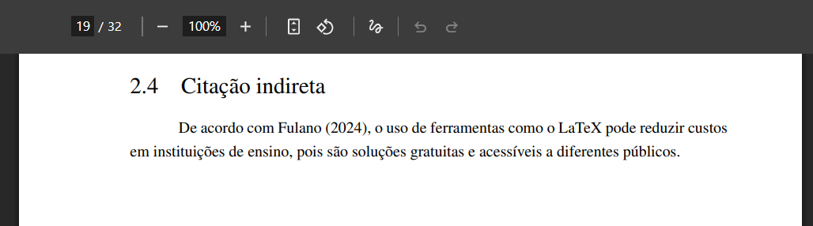

# Citação Indireta

A citação indireta consiste na reprodução, com as próprias palavras do autor do trabalho, das ideias de um autor consultado. É uma forma de demonstrar a compreensão do texto original e contextualizar a informação no desenvolvimento do trabalho acadêmico. Segundo a norma **ABNT NBR 10520**, a citação indireta deve conter a identificação do autor e o ano da publicação, e, quando necessário, incluir a página.

## Como fazer uma citação indireta

Para elaborar uma citação indireta, deve-se interpretar e reescrever a ideia do autor de maneira fiel, sem transcrever literalmente o texto. Essa técnica ajuda a integrar melhor as informações à argumentação do trabalho.

**Exemplo:**

```md
De acordo com \citeonline{fulano}, o uso de ferramentas como o LaTeX pode reduzir custos em instituições de ensino, pois são soluções gratuitas e acessíveis a diferentes públicos.
```

No exemplo acima, a ideia do autor é preservada, mas com reescrita e adaptação à estrutura do texto do trabalho.

A imagem abaixo ilustra como a citação indireta será exibida no documento final em PDF:



## Quando usar citação indireta

A citação indireta é recomendada quando:

* O objetivo é apresentar a ideia do autor de forma resumida ou com palavras próprias;
* A integração do conteúdo ao texto precisa ser mais fluida;
* O foco é destacar a interpretação do autor do trabalho.

## Citação indireta com vários autores

Quando houver mais de um autor, utilize o conectivo “e” entre dois nomes ou “et al.” para três ou mais autores.

**Exemplo:**

```md
Segundo \citeonline{exemplo_varios_autores}, a utilização de métodos participativos potencializa a construção coletiva do conhecimento.
```

Veja a configuração para o [BibTeX](/criando-um-documento/elementos-pos-textuais/referencias) para o `Author`:

```bib
@misc{exemplo_varios_autores,
  Author = {Souza, Reinan. and Batista, Anderson.},
  Year = {2025}
  ...
}
```

A imagem abaixo ilustra como a citação indireta vários autores será exibida no documento final em PDF:


**Exemplo com mais de três autores:**

```md
Segundo \citeonline{exemplo_tres_ou_mais_autores}, os estudos indicam que a integração de ferramentas digitais melhora o engajamento dos alunos no ambiente acadêmico.
```

Veja a configuração para o [BibTeX](/criando-um-documento/elementos-pos-textuais/referencias) para o `Author`:

```bib
@misc{exemplo_tres_ou_mais_autores,
  Author = {Souza, Reinan. and Batista, Anderson. and Costa, Gabriel. and Silva, Maria.},
  Year = {2025}
  ...
}
```


## Referência

> ESPM. *Citação indireta*. Normas ABNT, 7 ago. 2023. Disponível em: [https://normas-abnt.espm.br/index.php?title=Cita%C3%A7%C3%A3o\_indireta](https://normas-abnt.espm.br/index.php?title=Cita%C3%A7%C3%A3o_indireta). Acesso em: 30 jul. 2025.

> UNIVERSIDADE ESTADUAL PAULISTA “Júlio de Mesquita Filho”. *Manual de normalização de trabalhos acadêmicos: citação e referência: ABNT*. Grupo de Normas Técnicas Documentais, 2023. Disponível em: [https://www.fclar.unesp.br/Home/Biblioteca/normasparapublicacoes/abnt-atualizado-fev-2024.pdf](https://www.fclar.unesp.br/Home/Biblioteca/normasparapublicacoes/abnt-atualizado-fev-2024.pdf). Acesso em: 30 jul. 2025.

> ESPM. *A partir de quatro autores*. Normas ABNT, 7 ago. 2023. Disponível em: [https://normas-abnt.espm.br/index.php?title=A_partir_de_quatro_autores](https://normas-abnt.espm.br/index.php?title=A_partir_de_quatro_autores). Acesso em: 30 jul. 2025.
