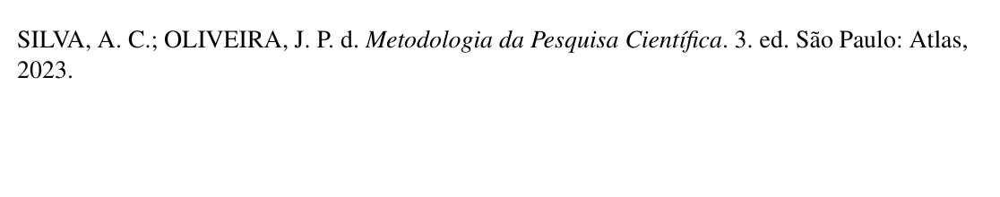

# Livro

Nesta seção, abordaremos especificamente como elaborar referências para livros utilizando o formato BibTeX no VixeText, conforme as normas ABNT. A configuração das referências deve ser realizada no arquivo `referencias.bib`, localizado no diretório `config`.

## Importância da referência correta

Referenciar corretamente as obras consultadas é fundamental para garantir a credibilidade e qualidade acadêmica do seu trabalho. Uma referência precisa possibilita que outros pesquisadores localizem facilmente as fontes utilizadas, promovendo transparência e integridade intelectual.

## Formato BibTeX para livro

Para criar uma referência para um livro no formato BibTeX, utilize o seguinte modelo básico:

```bibtex
@book{identificador,
  author    = {Sobrenome, Nome},
  title     = {Título do Livro},
  publisher = {Editora},
  year      = {Ano de Publicação},
  address   = {Local de Publicação},
  edition   = {Edição (opcional)},
  volume    = {Volume (opcional)},
}
```

* **`identificador`**: Uma chave única usada para citar a obra no corpo do texto.
* **`author`**: Nome do autor do livro. Caso haja mais de um autor, separe-os por "and".
* **`title`**: Título da obra, exatamente como consta na publicação.
* **`publisher`**: Nome da editora responsável pela publicação.
* **`year`**: Ano da publicação do livro.
* **`address`**: Cidade onde o livro foi publicado.
* **`edition`**: Indique a edição, caso não seja a primeira (opcional).
* **`volume`**: Volume do livro, se aplicável (opcional).

### Exemplo de Referência para Livro

Veja um exemplo prático:

```bibtex
@book{silva_metodologia_2023,
  author    = {Silva, Antônio Carlos and Oliveira, José Pereira de},
  title     = {Metodologia da Pesquisa Científica},
  publisher = {Atlas},
  year      = {2023},
  address   = {São Paulo},
  edition   = {3},
}
```

Para citar esta obra no seu documento Markdown com o VixeText, utilize o identificador definido:

```markdown
Conforme apresentado por \citeonline{silva_metodologia_2023}, a metodologia científica é crucial para o desenvolvimento acadêmico.
```

O resultado será uma referência formatada automaticamente de acordo com as normas ABNT pelo VixeText. A imagem abaixo ilustra o resultado final em PDF:



Segue um exemplo de citação que indica um capítulo ou página específica de um livro:

```markdown
O termo pesquisar pode ser entendido, num sentido amplo, como a maneira de buscar respostas para as questões propostas pelo pesquisador \cite[p. 2]{silva_metodologia_2023}.
```

## Referência

> ESPM. *Livro*. Normas ABNT, 8 ago. 2023. Disponível em: [https://normas-abnt.espm.br/index.php?title=Livro](https://normas-abnt.espm.br/index.php?title=Livro). Acesso em: 30 jul. 2025.
