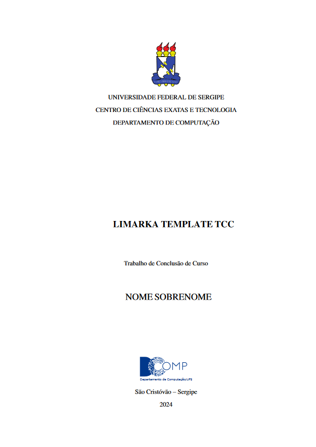

# UFS

Este guia destina-se a usuários que desejam criar documentos de trabalho de conclusão de curso (TCC) seguindo as normas estabelecidas pela [Universidade Federal de Sergipe](https://cienciainformacao.ufs.br/pagina/8648-trabalho-de-conclusao-de-curso-tcc). Para facilitar a aderência às especificações do Instituto, fornecemos um modelo pré-configurado baseado nas diretrizes fornecidas por professores do campus Lagarto para uso na plataforma Overleaf. Este modelo foi adaptado para ser compatível com o Limarka, visando simplificar o processo de escrita e formatação do seu documento.

## Visão geral do modelo

O modelo foi desenvolvido para atender às necessidades específicas dos alunos da Universidade Federal de Sergipe, incorporando elementos de formatação e estrutura recomendados. A seguir, apresentamos uma imagem ilustrativa do modelo configurado, demonstrando a disposição dos elementos conforme as normas do Instituto.



## Procedimento de configuração do modelo

1. Localize o arquivo `latexcustomizacao.sty`:
   - Este arquivo encontra-se na raiz do seu projeto e contém as definições de estilo que serão aplicadas ao seu documento.
1. Prepare o código de configuração:
   - O código necessário para a configuração do modelo está disponibilizado neste guia:

```latex
% ---
% CUSTOMIZAÇÕES LATEX PARA O SEU TRABALHO
% ---

\ProvidesPackage{latexcustomizacao}[2017 Criacao desta customizacao do abnTeX2]

% Adicione seus códigos abaixo:

% ---
% CUSTOMIZAÇÕES LATEX PARA O SEU TRABALHO
% ---

\ProvidesPackage{latexcustomizacao}[2017 Criacao desta customizacao do abnTeX2]
% Adicione seus códigos abaixo:
% alterando a capa
\renewcommand{\imprimircapa}{%
  \begin{capa}%
    % Todos os elementos da capa devem esta centralizado
        \center
        % Todos os elementos da capa devem esta em negrito
        \bfseries

    \includegraphics[scale=0.12]{imagens/logo-ufs} \\
    \vspace{0.1cm}

        \MakeUppercase{\ABNTEXchapterfont\large\imprimirinstituicao} \\

        \vspace{\onelineskip}

    {\ABNTEXchapterfont\large\imprimirautor}

    \vfill
    \begin{center}
    \ABNTEXchapterfont\bfseries\LARGE\imprimirtitulo
    \end{center}
    \vfill

    \large\imprimirlocal

    \large\imprimirdata

    \vspace*{1cm}
  \end{capa}
}
```

1. Atualize o arquivo `latexcustomizacao.sty`:
   - Substitua o conteúdo existente no arquivo `latexcustomizacao.sty` pelo novo código de configuração copiado. Esta ação atualizará as regras de estilização do documento para refletir o padrão adotado pela Universidade Federal de Sergipe.

## Conclusão

Ao seguir os passos descritos acima, seu projeto será configurado para aderir ao modelo especificado pela Universidade Federal de Sergipe, garantindo que o seu documento de TCC esteja em conformidade com as normas acadêmicas estabelecidas. Encorajamos a verificação cuidadosa do documento final para assegurar a total aderência às diretrizes.

Este guia foi elaborado para auxiliar na configuração eficaz do modelo de documento, proporcionando uma base sólida para a sua escrita acadêmica e contribuindo para a excelência na apresentação do seu trabalho de conclusão de curso.
